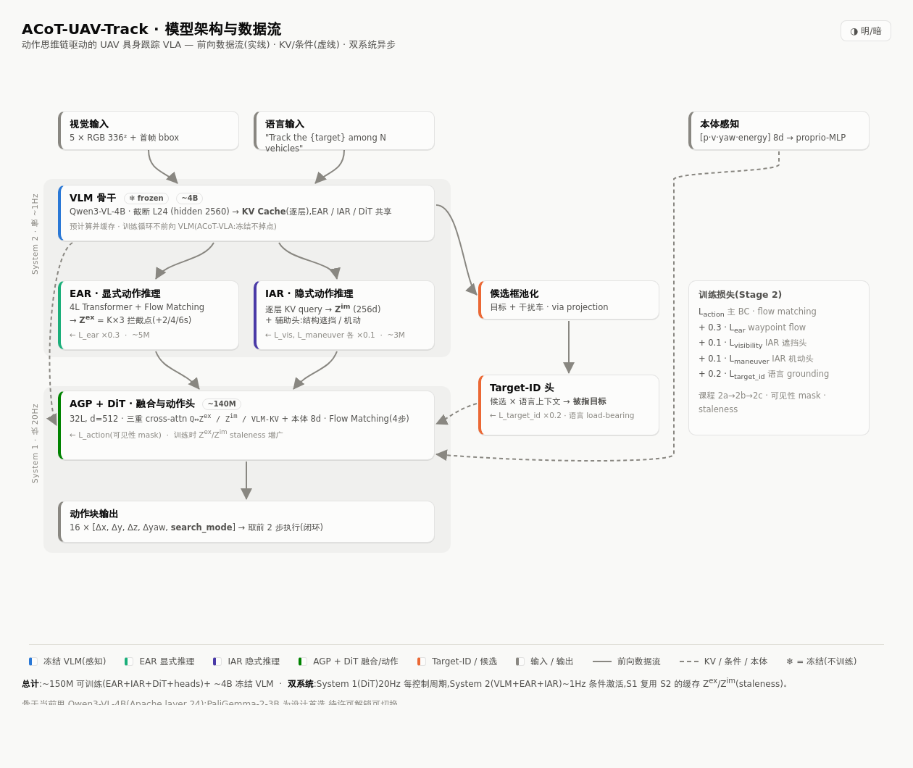
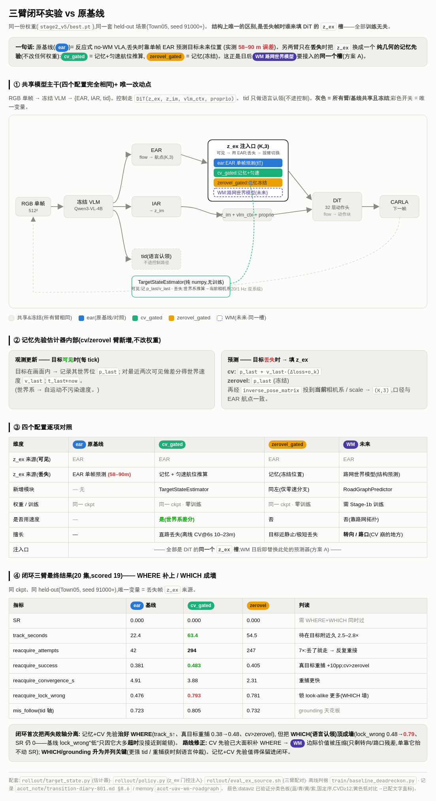

# 暑期研究进展汇报 · ACoT-UAV-Track

**汇报人**：yuhe　**时间跨度**：2026-07 ～ 2026-08　**方向**：World Model (WAM) × VLA × LLM 的具身智能
**一句话**：把"无人机巡检"这一较窄的任务，升级为**"语言指定 + 多相似目标消歧 + 长丢失预测-拦截重捕获"的空中具身跟踪 VLA**，并用一整套严谨消融，第一次**干净地证明了"语言在该任务中不可或缺"**，同时定位出下一步必须从"反应式 VLA"演进到"带世界模型的 WAM"。

> 图例清单（均在本目录 `acot_note/`，可直接打开）
> - `arch_light.png` —— 模型架构与数据流总览（**图 1**）
> - `wam_architecture.html` —— 反应式 VLA → WAM 插入点对照（**图 2**）
> - `investigation_flow.html` —— WHERE/WHICH 双轴调查流程（**图 3**）
> - `three_arm_zex_injection.html` —— 三臂闭环实验结果（**图 4**）
> - `wm_scheme_compare.html` —— 世界模型方案 A/B 对照（**图 5**）
> - `具身智能底层架构全景.md` —— VLA / World-Model / WAM 光谱定位（**图 6/背景**）
> - `data_pipeline.html`、`training_dataflow.html` —— 数据与训练数据流详图

---

## 0. 方向对齐

之前向您汇报的是"**无人机巡检**"——本质上是一个反应式（reactive）的"看到目标→跟随"的控制任务。暑期这段时间，我把研究重心**主动调整到了当前具身智能的三条主线——World Model / WAM、VLA、LLM 的交叉点**上，具体承载体不变（还是无人机 + 跟踪），但问题被重新定义、难度被显著抬高，科学问题也变得更本质：

| 维度 | 之前（巡检） | 现在（WAM×VLA×LLM） |
|---|---|---|
| 任务 | 反应式跟随单个目标 | 语言**指定**目标 + 多辆**视觉相似**车消歧 + 长丢失后**预测拦截重捕获** |
| 核心能力 | 视觉伺服 | 语言 grounding（认对是谁）+ 世界预测（推断目标去哪）+ 动作生成（怎么飞） |
| 科学问题 | "能不能跟上" | "**语言到底是不是必需的？**"（H0）+ "反应式够不够，要不要世界模型？" |
| 方法栈 | PID / 检测跟踪 | 冻结 VLM（LLM 骨干）+ 动作思维链（ACoT）+ flow-matching 动作头 + 未来的路网世界模型 |

**为什么是这三者的交叉？** 用一张"建模目标"的谱系图（图 6）最清楚：

- **VLA** 建模 `P(a│o, l)`：观测+语言 → 动作（响应式映射）
- **World Model** 建模 `P(o′│o, a)`：预测动作的未来后果
- **WAM（World-Action Model）** 建模 `P(o′, a│o, l)`：联合预测未来状态 + 生成动作

本工作是**谱系轻量端的 world-model-augmented VLA**：骨干是标准 VLA（冻结 VLM + flow-matching 动作头），但装了一个**目标中心的预测核**，去预测目标未来 3D 轨迹/拦截点。三条主线在架构里各司其职，可以用 **WHERE / WHICH / HOW** 一句话概括：

> **WHERE**（目标要去哪）= 世界预测（EAR / 未来的路网 WM）　·　**WHICH**（哪一辆才是目标）= 语言 grounding（LLM/VLM）　·　**HOW**（无人机怎么飞）= 动作头 DiT

> ⚠️ **一个诚实的措辞边界**（也是我对自己 claim 的约束）：我**不自称做出了完整的 World Model / WAM**。教科书判据的 WAM 要预测未来**观测/视频**；我目前只预测**目标状态**、没有 imagined rollout，所以只**部分**满足，对外统一用"**world-model-augmented VLA**"这一已发表的准确术语。演进方向是 WAM，但当前不越界宣称。

---

## 1. 任务定义

**四轴交集**（据调研，截至 2026-07 是一个尚无人占据的组合）：

> **空中主动飞行　+　语言指定目标车辆　+　多辆视觉相似干扰车消歧　+　具身闭环跟踪**

- **观测**：连续 RGB 帧（当前实现 512×512 @10Hz）+ 本体感知（无人机位置/速度/偏航/能量）
- **语言指令**：`"Track the {颜色+车型} among {N} other vehicles."`（**仅由语言指定目标，无持续首帧 bbox 身份锚**——这是 H0 的前提）
- **输出**：每步控制动作 `[Δx, Δy, Δz, Δyaw, search_mode]`（search_mode∈[0,1]：0=精确跟踪，1=全区搜索）
- **旗舰场景（本工作的差异化杀手锏）**：目标**转弯/被遮挡/驶出画面 → 长时间丢失 → 重新出现**。此刻**位置捷径失效 + 视觉连续性失效 + 外观不可分**三者叠加，**语言成为唯一可区分信号**；同时无人机**无路网约束**、可直飞拦截点抄近路重捕获——这是地面跟踪做不到的能力。

---

## 2. 系统架构



**整体**：一个**双系统（System-1 / System-2）**的 world-model-augmented VLA，思想承自 ACoT-VLA（把 Chain-of-Thought 从"文本空间"搬到"动作空间"）。

| 模块 | 作用（对应轴） | 规模 / 关键参数 |
|---|---|---|
| **冻结 VLM 骨干** | 感知+语言编码；全程冻结，前向可**预计算并缓存 KV** | **Qwen3-VL-4B**，截断至 **layer 24**，hidden **2560**，输入 **512²** |
| **EAR**（显式动作推理） | **WHERE**：flow-matching 预测目标未来 3D 航点/拦截点 `z_ex` | ~5M，4 层 Transformer，K=4 航点（+2/4/6s） |
| **IAR**（隐式动作推理） | 逐层 KV query → `z_im`，附遮挡/机动辅助头 | ~3M，256d |
| **AGP + DiT**（融合+动作头） | **HOW**：三重 cross-attn（`z_ex` / `z_im` / VLM-KV）+ 本体 → 动作块 | ~140M，32 层，d=512，flow-matching 4 步 → 16 步动作块 |
| **Target-ID 头** | **WHICH**：候选框 × 语言上下文 → 认出被指目标（语言 load-bearing 支点） | 语言 grounding 头 |

- **可训练总量 ~150M**（EAR+IAR+DiT+heads）**+ ~4B 冻结 VLM**。
- **双系统异步**：System-1（DiT）~20Hz 每控制周期跑；System-2（VLM+EAR+IAR）~1Hz 条件激活；S1 复用 S2 缓存的 `z_ex`/`z_im`（训练时用 **staleness 增广**模拟缓存过期）。
- **多任务损失**：`L = L_action + 0.3·L_ear + 0.1·(L_visibility + L_maneuver) + 0.2·L_target_id`。
- **训练三阶段**：Stage-1（EAR warmup，仅训 EAR，BC 回归）→ Stage-2（端到端联合，冻结 VLM，课程 2a→2b→2c，BC 模仿特权 PID 专家）→ Stage-3（闭环 RL / GRPO，只训 DiT 末几层，含 **R_correct_id** 防"跟随任意车"的 reward hacking）。

> 说明：早期设计文档曾计划用 PaliGemma-2-3B / 336px / layer-16；**实测后改为 Qwen3-VL-4B / 512px / layer-24**——这个改动（尤其分辨率）正是后文"语言必要性"能被证成的关键（见 §4）。

---

## 3. 暑期主要工作与产出（概览）

| # | 工作 | 状态 | 关键结论/交付物 |
|---|---|---|---|
| W1 | 打通完整训练管线（预计算→Stage-1→Stage-2） | ✅ | 8447 训练样本，27GB KV 缓存，多任务损失收敛 |
| W2 | 严谨消融证明"语言必要性"(H0) | ✅ | 发现并修复 **1 个指标假象 + 3 个几何捷径 + 1 堵分辨率墙**；干净结论 **有语言 58% vs 无语言 72%(≈瞎猜)** |
| W3 | 闭环评测/RL 训练 **harness**（M1–M5） | ✅ | 双容器 socket 桥；离线 mis_follow 逐位复现；闭环再证 H0（**Δ+0.32, 95%CI 不含 0**） |
| W4 | "反应式够不够"的公平基线测量 | ✅ | 反应式 EAR 出画预测误差 **58–78m**，比"目标冻结"还差 **4×** → 架构性缺陷，需世界模型 |
| W5 | 三臂闭环实验：分离 WHERE / WHICH 两条失败轴 | ✅ | 便宜先验补上 WHERE（跟踪时长 2.5–2.8×），但把 WHICH（语言认领）顶成墙 |
| W6 | grounding 归因攻击（损失/容量/绑定/分辨率） | ✅ | 损失杠杆、容量杠杆均死；瓶颈是**语言-属性绑定 + 特征可读性**，非头容量 |
| W7 | 相关工作与定位、数据集卡、方法论护栏 | ✅ | 四轴空白定位；引用真实性核验；6 条实验严谨性护栏固化 |

---

## 4. 核心科学贡献：语言到底有没有用？（H0）

这是暑期**最硬核的一块**——价值不在"堆了个模型"，而在**用一连串反直觉的消融，证明了任务本身在"逼"模型使用语言**。过程本身就是一个"如何不被自己骗"的方法论案例。

**H0（可证伪假设）**：*在"去几何相关 + 连续性断裂"的条件下，去掉语言，消歧会显著变差——语言表达了 click/bbox/GPS 无法表达的细粒度区分，是唯一具此表达力的指定方式。*
形式判据：H0 成立 ⟺ (a) 无持续首帧 bbox 身份锚 ∧ (b) 目标身份 ⊥ 位置/几何 ∧ (c) 目标身份 ⊥ 时空连续性 ∧ (d) ≥2 辆"语言可分、外观/运动不可分"的干扰车共视。

### 4.1 起点：一个"太好"的结果，其实是假的

最初模型的 mis_follow（跟错率）低到 ~2%，看似语言很有用。但严格消融戳破了它：

- **正式无语言消融（3 seeds，硬子集 ≥2 候选）**：**有语言 6.16%±1.81　≈　无语言 6.23%±1.12**——**语言零净贡献**。
- **根因 = 位置捷径**：一个只用 9 个几何特征（u,v,深度+排名，无外观无语言）的"最优位置分类器"就能拿到 **~3–5%**，比整个 VLM 还好。参照：中心挑 53%、最近挑 19%、瞎猜 ~70%。
- 工具固化：`train/benchmark_leak_probe.py`。

### 4.2 逐个拆掉的"捷径"与"假象"

| 被拆对象 | 现象 | 修复 | 效果 |
|---|---|---|---|
| **指标假象**（tid metric artifact） | mis_follow 从 44.9%→20%→0% 的"突破"是假的：目标恒在候选 idx0 + argmax 平票偏向 idx0 | 每帧**打乱候选顺序**（头是置换等变，**训练完全不变**，只让指标诚实） | 真值回到 44.9% = 位置地板 |
| **位置捷径**（§b） | 位置分类器 ~3–5% | 数据侧位置/深度/排名去相关，干扰车共享同分布 | 几何地板 5% → 42% |
| **深度/跟距捷径**（§8） | 无人机固定跟距 → 挑"最近/最典型深度"= 目标 ~58% | 随机化跟踪距离(8–40m)+高度(15–60m) | `nearest` 降到 31% |
| **居中捷径**（§9） | 相机瞄准把目标钉在光轴 → 目标系统性更居中（中心距中位 0.22 vs 干扰 0.35） | 相机瞄准点加随机偏置/抖动 | `most-central` 54.5% → 趋近瞎猜 |
| **分辨率墙**（§10，最深的一堵） | 几何全清后有语言仍 ~72%≈瞎猜 | **336px→512px**，FOV/跟距调整 | 车像素 **12px→27px**，语言"起死回生" |

**"分辨率墙"是最反直觉、也是最关键的发现**：几何捷径全部清除后，有语言依然打不过瞎猜。诊断出根因**不是数据/头/训练，而是图像分辨率**——336px+90°FOV+远跟距下，一辆车只投影出 **~12px**，身份信息在 tokenize 时就被抹掉了（线性探针只能读出 make 12% / color 23%）。**唯一改动**分辨率 336→512（车 12→27px）就把结果翻转。
配套的方法论洞察：**判断特征够不够，要看"同分布探针"而非"逐集探针"**——make 逐集只有 6%，但同分布高达 55%，说明 27px 特征其实富含身份，逐集低只是"线性映射跨集不迁移"，而端到端 VLM grounding 能迁移。

### 4.3 干净结论（离线）

版本演进（每一版只隔离一个变量）：

| 版本 | 条件 | 有语言 | 与瞎猜的 gap | 判读 |
|---|---|---|---|---|
| v3 | 几何捷径尚存 | 56% | 15pp | **假象**：56%≈几何地板 54% |
| v4 | 几何去相关，336px | 72% ≈瞎猜 | ~3pp | 语言"想用却用不上"（车 12px） |
| **v5** | 几何去相关，**512px** | **58%** | **~13pp** ✅ | **语言第一次干净 load-bearing** |

> **里程碑（2026-08-16，run `mvp_full_v5`）**：在"几何全除净 + 指标诚实 + 训练稳定 + 分辨率够(27px)"四条件下，**有语言 ~58% vs 无语言 ~72%(≈瞎猜 76%)，稳定 ~13pp gap**——语言必要性首次被干净证成。

### 4.4 闭环再验证（更强证据）

在闭环 harness 上（Town05 **held-out 未见地图**，7 对配对 seed，`best.pt`）复测无语言消融：

```
mis_follow(持续):  有语言 M0 = 0.606 ± 0.30   无语言 M1 = 0.923 ± 0.08
Δ(M1 − M0) = +0.317    95% CI [+0.14, +0.51]   ← 不含 0
H0 判定：LANGUAGE LOAD-BEARING ✅
```

**闭环 +32pp gap ＞ 离线 +14pp**：误差累积会**放大**语言依赖——这是把离线证据第一次在**未见地图、on-policy** 上兑现。诚实边界：两臂 SR 均为 0（跟约 20s 必丢=BC 分布漂移），且这是 **N=7、单地图、MVP 规模的趋势性结论，非定论**。

---

## 5. 从"反应式 VLA"到"WAM"：为什么必须演进


> **图 2**：反应式 VLA → WAM 插入点对照（交互版：`wam_architecture.html`）

证明了语言有用之后，第二个本质问题是：**只靠"看到→反应"够不够？** 答案是**不够**，而且我用公平实验把"世界模型的价值到底值多少、值在哪"精确框了出来（避免了"拍脑袋上大模块"）。

### 5.1 反应式的死穴：出画即失明

反应式模型每帧只看当前画面、**没有跨帧的目标状态记忆**（本体感知是无人机自己的状态，不是目标的）。目标一出画，模型看到的是"一张没有目标的图"，无法预测它去了哪。

**公平 no-WM 基线（2026-08-18，补齐 warmup + 5 层缓存 + intercept 监督）**：

| 指标 | 数值 | 判读 |
|---|---|---|
| EAR 出画 FDE @1s/6s | **58 / 78 m** | 灾难级 |
| "目标冻结"参照 persist @6s | 17.6 m | **EAR 比"目标不动"还差 4×** |
| 拦截朝向 cos（丢失，中位/>0.5 占比） | 0.87 / 66% | 34% 飞错方向 |
| mis_follow | 0.582 | 与 EAR/IAR 层数几乎无关 |

→ **出画预测失败是架构性的（单帧输入），不是欠训**。给足训练也救不回。世界模型有据可依。

### 5.2 但"世界模型"该做哪一段？——便宜基线阶梯

在建 WM 前先问"最便宜的几何外推能补多少"，量出 WM 的**边际价值边界**（FDE@6s，丢失帧）：

| 场景 | EAR（反应式） | 零速外推 | 匀速外推(CV) | persist |
|---|---|---|---|---|
| 短直线 | 68.1 | 26.1 | **10.9** | 16.7 |
| 长直线 | 90.0 | 47.5 | **23.2** | 17.1 |
| 短转弯 | 53.1 | 34.3 | 35.8 | 27.1 |
| **长转弯** | 58.1 | 49.9 | **47.5** | 28.2 |

**关键判读**：匀速外推(CV)全面碾压 EAR **2–6×**（反应式网络连"匀速外推"都没学到）；直路上便宜 CV 就够，**WM 的差异化价值精确锁定在"转弯/路口"这段残差**（CV 在转弯崩到 35–47m）。副产品：转弯帧严重欠采样（仅 20+27 帧）→ 把"转弯数据"从 nice-to-have 升级为 P1 硬前置。

### 5.3 三臂闭环实验：把 WHERE / WHICH 两条失败轴分开



> **图 4**：三臂闭环实验，唯一变量 = 丢失帧谁来填 DiT 的 `z_ex` 槽（交互版：`three_arm_zex_injection.html`）

**同一份权重、同一套 held-out 场景，唯一变量 = 丢失帧谁来填 DiT 的 `z_ex` 槽**（全部训练无关，正是未来 WM 要接入的同一个槽）：

| 指标 | ear（基线） | cv_gated | zerovel | 判读 |
|---|---|---|---|---|
| SR | 0.000 | 0.000 | 0.000 | 需 WHERE+WHICH 同时过 |
| track_seconds | 22.4 | **63.4** | 54.5 | 待在目标附近 **2.5–2.8×** |
| reacquire_success | 0.381 | **0.483** | 0.405 | 真目标重捕 **+10pp** |
| reacquire_lock_wrong | 0.476 | **0.793** | 0.781 | 锁错 look-alike 更多（WHICH 墙） |

**这是全暑期最有信息量的一个实验**：便宜的"记忆+CV 先验"**治好了 WHERE**（无人机不再一丢就走、跟踪时长翻倍、真目标重捕率↑），**但恰恰因此把 WHICH（语言认领）顶成了卡住 SR 的墙**（锁错率 0.48→0.79，SR 仍 0）。
**路线修正**：① CV 先验值得保留进闭环；② WM 的边际价值被压缩到"转弯/路口残差"，单靠它抬不动 SR；③ **WHICH/grounding 升为并列关键**（更强 tid / 重捕获时刻的语言仲裁）。

### 5.4 grounding 归因攻击：瓶颈到底在哪

进一步逐一排除"便宜修法"（2026-08-21~24），结论很干净——**墙是"语言-属性绑定 + 特征可读性"，不是头容量/损失**：

- **损失杠杆死**：ce / margin / hardneg 最好都 ~0.50；
- **容量杠杆死**：tid_d 256→512→768，d512(0.498) ≈ d256(0.505)，纹丝不动；
- **绑定修法有效**：CLIP 式 AttrBindHead 首次把最难的 tier-c 从 0.630→0.559（overall 0.510→0.441）；但叠加 ctx cross-attn 无增益（**ctx 对 grounding 冗余**）；
- **残差天花板**：即便属性完美，tier-c 仍 0.558 = **特征可读性上限**（分层：tier-a 0.34 / tier-c 0.70；<20px 0.78 vs 20–35px 0.54；候选越多越接近瞎猜）；
- **诚实的负结果**：离线 −7pp 的绑定优势**在闭环不迁移**（track_xattn 0.745 vs track_attr 0.742，两头闭环都收敛到 ~0.74）——原因是专家轨迹训练帧 vs 学生轨迹部署帧的**分布漂移(OOD)**。这反过来说明 **Stage-3 闭环 RL 是必要的**（离线赢 ≠ 闭环赢）。

---

## 6. 数据与工程基建


> **图 3**：WHERE/WHICH 两条失败轴的调查流程（交互版：`investigation_flow.html`）

**数据集（CARLA 仿真，MVP 规模）**：~60 集 / ~100K 帧 / RGB（v5 已升 512px）/ 10fps；每集 = 1 语言指定目标 + 若干视觉相似干扰车；专家 = 特权 PID 视觉伺服（学生只看 RGB+语言，做**特权信息蒸馏**）。HDF5 逐帧含 `rgb / state(本体+相机位姿+遮挡) / target(3D 状态) / action / distractors(轨迹+bbox) / annotation(bbox+遮挡+search_mode+waypoints)`。语言模板：`[动作]+the[颜色+型号]+[空间关系]+[运动意图]+[距离约束]`，全 GT 驱动、**已移除冗余消歧从句**。跨版本 v2→v5 逐版关闭几何捷径（如 v5：位置地板 4%→56.6%、长丢失最长 8.9s、9/10 集 ≥2 相似车）。

**数据验收契约（两 agent 闭环 review）**：`iter/review_sample.py` 为唯一真值——硬门（schema 完整/无 NaN/最短 70 帧/≥8 集）+ 软门（`leak_floor≥0.60`、`covis≥0.40`、`recovery≥0.20`、`jitter≤1.0`）；连续 2 轮无改善即暂停人工。

**闭环 harness（M1–M5 全部建成并逐个验证）**：把离线数据生成循环里的"特权 PID 专家"换成"训练好的 VLA 策略"，**同时是 Stage-3 RL 的训练底座（硬前置）**。

| 里程碑 | 验证结果 |
|---|---|
| M1 在线 VLM | **与离线缓存逐位一致**（cos=1.0, diff=0.0） |
| M2 策略加载 | **复现离线 mis_follow=0.579（Δ=0）** |
| M3 候选构造 | GT 投影 + 打乱 + 无身份锚 |
| M4 打分器 | 迟滞 mis-follow / SR / 重捕获 / 捷径指标 |
| M5a CARLA 倒置循环 | 专家 **200/200 帧，跟距 30.9m ≈ 语言"30m"** |
| M5b socket 桥真策略 | 端到端真闭环打通 |

**最大工程约束**：CARLA(py3.6/0.9.15) 与 VLA policy(py3.11+VLM) **不能同进程** → 用**双容器 socket 桥**（length-prefixed pickle proto=2 互通，`cand_feats 不过网`）。

---

## 7. 相关工作与定位

- **四轴空白**：据 2026-07 调研，"空中主动飞行 + 语言指定 + 相似车消歧 + 具身闭环"这一组合尚无人占据；杀手锏（长丢失重现时刻语言作为唯一可分信号 × 无路网直飞拦截）被评为高置信度真空白。
- **主要竞品与切割**：**UAV-Track VLA**（2604.02241，空中·CARLA，但**无相似车消歧、行人域**，是要清晰对切的 #1，注意**不是**本工作）、**TrackVLA**（CoRL 2025，地面第一人称）、**TrackVLA++**（消歧靠**非语言**的极坐标 CoT+时序记忆）、**DeTrack**（空中双世界模型但**纯视觉无语言**）、**AerialMind**（AAAI-26，被动 referring-MOT，**不控制无人机**）。
- **定位（诚实一句话）**：world-model-augmented 具身 VLA，在空间智能 survey 标为开放前沿的三条轴（主动感知 / 动态空间推理 / 持久空间记忆）给出统一具身实现；**不主张"跟踪=空间智能"、不 claim"首个融合"、不自称 WAM/world model**。novelty 押在"域（空中具身跟踪）+ 状态-动作同构洞察（拦截点=世界预测∧动作计划）"。
- **引用真实性核验**：已核实 TrackVLA 为 CoRL 2025、AerialMind 为 AAAI-26；明确标出并规避一个**虚构引用**（不存在的 "CosFly-VLA"，真实的是非-VLA 的 CosFly / CosFly-Track）。

---

## 8. 方法论收获（体现研究成熟度）

暑期反复踩坑后固化了 6 条"防自欺"护栏，已写入长期记忆，是这段工作**除结果外的另一层价值**：

1. **加复杂度前先测上限**——建 WM 前先测反应式的预测天花板（公平基线 + 便宜阶梯），才知道 WM 值在"转弯/路口"这段。
2. **正对照/oracle 天花板**——用"最优纯几何分类器"量出捷径地板；用"完整描述 100% 唯一 → 语言 oracle 天花板=0%"确认任务可解。
3. **信一个 delta 前先公平复训**——E1 的 EAR 欠训（跳过 warmup / 1 层缓存）不能当"原模型上限"，必须公平重训后再比。
4. **同分布探针 ≠ 逐集探针**——make 逐集 6% 却同分布 55%，避免把"线性不迁移"误判成"特征没身份"。
5. **假设 vs 实测要标清楚、要测别猜**——"14m 误差是深度"被实测证伪（其实是横向主导），旧猜测作废。
6. **长跑运维**——detached 容器（`DETACH=1`）+ 日志落盘 + 显式存 checkpoint（曾因未存 ckpt 丢过 2 次 run）。

---

## 9. 下一步路线图


> **图 5**：世界模型方案 A（保留 EAR）vs 方案 B（并入 WM）对照（交互版：`wm_scheme_compare.html`）

关键路径：`P1 数据 + P3 harness（已建，并行）→ P2 WAM → P4 闭环 eval（含语言集成）→ [P5 RL]`

| Phase | 内容 | 依赖 |
|---|---|---|
| **P1** 长丢失+拦截数据 | 5–15s 丢失 + 专家直飞拦截 demo + 目标重现 + 重现时刻 ≥2 look-alike 共视；**转弯数据优先** | 无 |
| **P2** 路网世界模型（RoadGraphPredictor，**方案 A**） | 反应式→世界建模，**不靠速度靠路网拓扑**（PGP/DenseTNT 式车道图遍历 + 分叉选择）；分工：WM=远端 WHERE，EAR 保留做近端可见 WHERE 融入 `z_ex`，语言=WHICH，DiT=HOW | P1 + CARLA 车道图 GT |
| **P3** 闭环 harness | 已建成（M1–M5） | ✅ |
| **P4** 闭环 eval + 语言集成 | 断裂→重捕获（有无语言 mis_follow 跳变）、锁对率、SR-vs-丢失时长曲线 | P2+P3 |
| **P5** Stage-3 闭环 RL | GRPO，DiT 末层，reward 含 R_correct_id + R_reacquire | P3+P4 |

**论文分层**：L0 已验证骨架（无语言证伪 + 位置捷径量化 → 长丢失升级，paper1 motivation）→ L1 核心方法（EAR + 目标状态记忆 + 长丢失数据 + mask 反转，**paper1 主贡献**）→ L2 路网 SEP 先验（paper1 增强或 paper2 核心）→ L3 语言"which-way"意图（**推迟到 paper2**，避免 H0 归因从 2 个捷径膨胀到 4 轴的 reviewer 风险）。**铁律：L1 未站稳前不投 L2/L3 的实现资源。**

---

## 10. 量化指标速览（一页）

| 主题 | 指标 | 数值 |
|---|---|---|
| **语言必要性(离线,v5)** | 有语言 vs 无语言 mis_follow | **58% vs 72%（≈瞎猜 76%），gap ~13pp** |
| 分辨率翻转 | 车像素 / make 探针 | 336px→512px：12px→27px；同分布 make 55% |
| **语言必要性(闭环)** | Δ(无语言−有语言), 95%CI | **+0.317, [+0.14, +0.51]**（不含 0） |
| 位置捷径 | 最优几何分类器 / 有语言vs无语言 | ~3–5% / 6.16% vs 6.23%（无差异） |
| 反应式死穴 | EAR 出画 FDE@6s / persist | **78m / 17.6m（差 4×）** |
| WM 价值边界 | CV vs EAR FDE@6s（长转弯） | 47.5m vs 58.1m（直路 CV 10–23m 碾压） |
| 三臂闭环 | 跟踪时长 / 真目标重捕 / 锁错率 | 22→63s / 0.38→0.48 / 0.48→0.79 |
| grounding 瓶颈 | 损失/容量杠杆 / 绑定修法 | 均死(~0.50) / tier-c 0.63→0.56 |
| 架构 | 可训练 / 冻结 | ~150M / ~4B（Qwen3-VL-4B, 512px, layer24） |
| 数据/harness | 规模 / 里程碑 | ~60 集~100K 帧；M1 逐位一致，M2 mis_follow=0.579 复现 |

---

### 一句话收尾
> 暑期没有停留在"把无人机跟踪跑通"，而是把它做成了一个**能回答本质问题的科学载体**：先用一整套消融**干净证明了"语言在多相似目标消歧中不可或缺"**（并在闭环上放大验证），再用公平实验**定位出"反应式 VLA 不够、需要世界模型、且 WM 的价值精确在转弯/路口那段、而语言认领是并列的墙"**。这正好把 **WAM（世界预测）× VLA（动作）× LLM（语言 grounding）**三者的交叉，落到了一个可验证、可发表的具体问题上。
