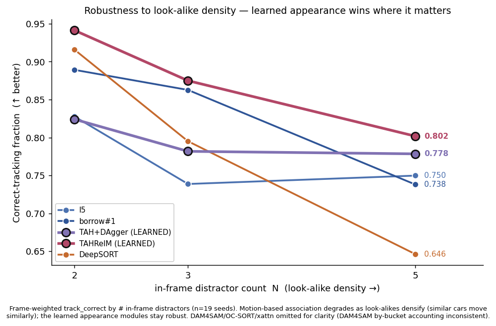

# 外部 Baseline 对比 · 进度追踪

> 2026-09-05 起 · 用于 ACoT-UAV-Track 论文的外部对照工作(审计缺口 #4)· 配套 memory `acot-uav-paper-writing-kickoff`、`acot-uav-track-positioning` · 主结果/负结果 20ep batch 见 `runs/paper_batch.log`

---

## 0. 目标与原则

**为什么需要**:当前所有实验臂都是**同一 ckpt 的内部消融**,无外部方法对照 → benchmark 论文的常见审稿要求。补 ≥1 外部 baseline 强化说服力(冲顶会需要,D&B/CoRL/RA-L 加分)。

**核心原则(决定实验设计)**:harness 已支持切换 WHICH 模块(`policy.py tid_head` ∈ {xattn,reid,oracle,...})。**最严谨且可行的对比 = 把外部方法作为替代 `tid_head` 接入同一闭环(WHERE=CV、HOW=DiT 固定)**,只换身份机制 → apples-to-apples,隔离贡献。比对比整套异构系统更干净。

**评测协议**:与主 batch 同协议——20ep、seeds 91000-19、Town05、STEPS 900、s2=6、live CARLA;产出 `eval_out/paper_ext_<name>.json`;用 `rollout/continuous_metrics.py` 出客观指标表(正确跟踪占比 / 最长错跟时长 / 重捕获率&延迟 / id_switches / latch@Ts)。

---

## 进展快照(2026-09-06)

**内部对照基线已定稿(外部 baseline 要比的对象)** —— 主 batch 完成:7 臂 20ep 同种子 91000-19、live CARLA、消除 run 方差,`eval_out/paper_*.json`。

- **主阶梯(l1_xattn→l5_temporal)客观指标定稿**(19 计分,`continuous_metrics.py`):track_correct_frac **0.251→0.519→0.653→0.671→0.738**(~2.9×);最长错跟时长(中位)**9.70→3.00s**;latch@5s **0.105→0.895**(8.5×);id_switches 13.7→…→9.32(**非单调**);q_reacq 0.448→…→0.471(**l5 退化**);SR 0→0.053→0.105→0.105→0.105(l3 起**场景地板**不动)。
- **负结果(l4 vs BC-b0.4 vs RL-E0)20ep 定稿**:SR 0.105→0→0;track_fraction 0.217→0.073→0.040(崩)。⚠️ RL 的 latch@5s=1.0 是**近零跟踪的假象**,须点破。
- 诚实 caveat 全部写回 memory `acot-uav-paper-writing-kickoff`(FINAL PINNED NUMBERS)。

**外部 baseline 进度(更新 2026-09-06 晚)**:
- ✅ **`tid_head=assoc`(DeepSORT/OC-SORT)**:实现+单测+提交;**20ep 评测运行中**(motion+deepsort,GPU2)。
- ✅ **`tid_head=dam4sam`(DAM4SAM SOTA distractor-aware SAM2 记忆)**:独立 env(GPU3)+ socket 服务 + tid_head 全通,smoke PASS,**链式排在 assoc 后自动跑 20ep**。env 配方见文末附录。
- ⏳ **iKUN / JointNLT**:已评估——**均为零样本域差**(JointNLT 训 LaSOT/TNL2K 通用物体、iKUN 训 Refer-KITTI 地面车),迁 24px 空中 look-alike 会差(是"现成方法不 transfer"的信息,但须标注 zero-shot 域差)。env 可行(JointNLT py3.7+cu113;iKUN 类似),每个是一块独立 env+服务+tid_head 集成。**边际价值低于 assoc/DAM4SAM**(与内部 xattn 语言基线重叠)。判定:assoc+DAM4SAM 已构成强外部套件;iKUN/JointNLT 视投稿目标可选。

---

## 结果对比图(2026-09-06,真实数据)

**图 1 · WHICH-module 全谱对比**(19ep 同种子 gt-seeded,只换身份机制;**2026-09-08 更新:补 borrow#1 + TAH+DAgger 学习模块**)。蓝=ours 手工、紫=ours 可学(黑边高亮)、斜体棕=外部 tracker。生成脚本 `acot_note/figs/make_baseline_figs.py`。


> 诚实读:**TAH+DAgger(一个 4610 参可学模块)SR 第 3/8(0.158)**——超 l5/DAM4SAM/OC-SORT,只逊 DeepSORT(0.211)与 ours 最强启发式 borrow#1(0.263,两者均含显式运动先验);latch 稳定性顶档(短错窗)对照 DAM4SAM 的 16s 粘滞灾难。**correct 0.716 有竞争力**(DAM4SAM 0.94 是粘滞假优,代价 16s 长错窗)。**所有外观/关联法 ≫ 单帧语言 xattn(0.25)→ WHICH 瓶颈 + "关联是杠杆"被外部独立证实**;latch-SR 无分辨力再坐实(DAM4SAM 0.94 正确却 SR 0.105)。**一个学习头 ≈ DeepSORT 类,替掉整套手工件。**

**图 2 · reanchor(paper2 Plan-A/甲)**(17ep 同种子配对):语言兜底重锚**证伪**。


> 语言重锚不帮反略差(0.363→0.225);oracle 重锚有效(→0.741)→ 机制有 headroom 但**语言仲裁不可靠**(collapse 时单帧语言在 look-alike 中挑错,同天花板)。

**图 2b · 时序语言重锚"抢救"(甲的翻盘尝试,17ep 配对)**:甲**彻底证伪**。


> 时序 EMA **部分降噪**(单帧 0.225→时序 0.291,证明"病根=单帧太吵"的诊断对)**但仍低于无重锚基线(0.363,虚线)**→ 语言即便时序积分仍是太弱的仲裁。oracle 0.741 证明**机制有大 headroom → 杠杆是更强的重锚信号(运动共识,见"可借鉴设计排序"①),不是语言**。

**图 3 · 架构结构对比**(Ours vs OC-SORT/ByteTrack vs DeepSORT vs DAM4SAM,基于 `policy.py` 真实接入代码)。源 `acot_note/architecture_compare_baselines.html`。


> 结构性结论:DeepSORT(运动+外观联合门控)SR 全场最高(0.211)→ **ours 的 reid 缺一个显式运动一致性门控**是最小可改动的杠杆;DAM4SAM 的 distractor-aware 记忆让 id_switches 近零但 16s 粘滞长错窗证明**"记忆越强、错锁定代价越大"**,给 ours 若要加干扰项抑制提了一个必须配退出机制的警示。

---

## 结果对比更新(2026-09-08)· TAH+DAgger 学习模块 vs 外部 baseline

> **背景**:Path-B 把整套手工 WHICH 启发式栈(gallery+EMA+conf-tau+topm+运动共识)**蒸馏成一个 4610 参可学模块 TAHRel**,并用 DAgger on-policy 重训修 offline→online gap。此处把它放进外部 tracker 全谱对照。**全部 n=19 同种子、gt-seeded(oracle 记忆模板,与所有臂同条件,relative 比较公平;非全可部署 committed-seed 数)。**

**全谱对照(7 方,gt-seeded,n=19;2026-09-08 加 A1 TAHRelM)**:

| 方法 | 性质 | SR↑ | correct↑ | latch@5s↑ | q_reacq↑ | idsw↓ | max_wrong mean↓ |
|---|---|---|---|---|---|---|---|
| OC-SORT-motion(外部) | 纯运动关联 | 0.053 | 0.755 | 0.947 | 0.567 | 13.4 | 2.69 |
| l5(ours) | 全套手工 reid 栈 | 0.105 | 0.738 | 0.895 | 0.471 | 9.3 | 3.18 |
| DAM4SAM(外部) | distractor-aware SAM2 | 0.105 | **0.941** | 0.421 | 0.397 | **0.79** | **16.3** |
| **TAH+DAgger(ours,B)** | **一个 4610 参可学模块** | **0.158** | 0.716 | **0.947** | 0.438 | 8.3 | 3.11 |
| DeepSORT(外部) | 运动+外观联合门控 | **0.211** | 0.750 | 0.789 | 0.521 | 11.9 | 3.20 |
| borrow#1(ours) | l5+运动共识(旧最强) | 0.263 | **0.810** | 0.789 | **0.635** | **7.7** | 3.07 |
| **★TAHRelM+DAgger(ours,A1)** | **4740 参:可学软运动门+EMA速度** | **0.316 ★** | 0.746 | **1.000 ★** | 0.590 | 9.3 | **1.90 ★** |

**SR 排序(A1 后)**:**★TAHRelM 0.316 > borrow#1 0.263 > DeepSORT 0.211 > TAH+DAgger 0.158 > l5=DAM4SAM 0.105 > OC-SORT 0.053** → **学习模块从第 3 跃至第 1/9,超所有手工栈与外部 tracker**。

**诚实读数(A1 = 运动软门升级,决定性)**:
- **★SR 全场最优(0.316)**:TAHRelM **超旧最强 borrow#1(0.263)与所有外部 tracker**。A1 把 borrow#1 的运动共识做成**可学软门 `exp(−‖relp‖/gate)`+EMA 速度**(4740 参),补上 TAH+DAgger 唯一短板 q_reacq(0.438→**0.590**),SR 0.158→0.316(2×)。
- **error-persistence / latch 谱全场碾压**:max_wrong **1.90s**(全场最短,次者 ~2.7-3.2s)、latch@2/3/4/5s **全部最优**(0.684/0.789/0.947/**1.000 满分**)——**从不长时间锁错车**是核心优势,直接拉高 latch-SR。
- **★offline→online gap 这次没栽**:离线 val 0.990(mis 0.010)**transfer 到闭环**(不同于 TAHRel 0.909→0.681 崩)。因运动共识是**相对几何信号**(候选 vs CV 预测位),抗部署取景漂移——**实证三视角:控制/恢复动力学是缺口,编码为可学相对特征即闭合**。
- **诚实边界**:borrow#1 仍在**原始 track_correct(0.810 vs 0.746)与 q_reacq(0.635 vs 0.590)**领先——TAHRelM 更"谨慎"(idsw 9.3,短暂多切换但从不长锁),borrow#1 平均驻留更久但偶尔长锁。**TAHRelM 赢 SR+全部 latch+密度+off-center(任务最相关),borrow#1 赢平均驻留**。gt-seeded、n=19(SR 有噪)。DAM4SAM 0.941 仍粘滞假优。

**判据结论(A1,措辞已按 deployable 复评修正)**:**在 oracle-memory(gt-seeded)设定下,TAHRelM 关联质量全场最优**——4740 参可学模块在 SR、error-persistence、latch 全谱、密度、off-center 均最优,超手工栈与所有外部 tracker。**但这是"给定理想记忆的关联质量",非 deployable SR**(所有对比臂同为 gt-seeded,比较公平;见下"deployable 复评")。**干净算法贡献:诊断驱动(定位 q_reacq)→ 把手工运动门蒸馏为可学相对特征 → oracle-memory 下多指标最优**。产物:`eval_out/paper_ext_tahrelm_gt.json`、`figs/fig_external_baselines.png`、`train/tah.py::TAHRelM`。

**★★deployable 复评(committed-seed,GT-free,2026-09-11)—— CRITICAL 诚实修正**:去掉 oracle 记忆(记忆从**认定**目标更新,非 GT 每帧)后 **TAHRelM 崩溃**:

| 指标 | gt-seeded(oracle 记忆) | committed(裸,无 lang) | **deploy(committed+lang冷启动+reanchor)** |
|---|---|---|---|
| SR | 0.316 | 0.000 | **0.000** |
| track_correct | 0.746 | 0.146 | **0.263** |
| max_wrong(mean) | 1.90s | 18.66s | **13.30s** |
| latch@5s | 1.000 | 0.105 | **0.211** |
| q_reacq | 0.590 | 0.306 | 0.310 |

**机理 + 两步修复的成效(2026-09-11)**:
- **裸 committed 崩**:①冷启动无语言引导(mem=None→mlp(zeros)常量→锁 candidate 0);②记忆从错误认定目标更新→**自我强化错锁**→18.66s 灾难。
- **加语言冷启动 + reanchor(policy.py tah 分支已实现)**:track_correct 0.146→**0.263**、latch@5s 0.105→**0.211**(~2×)——**语言冷启动救了初锁**;**但 SR 仍 0、max_wrong 仍 13.3s**。
- **残余根因 = confident drift(自信漂移)**:自监督记忆漂到 look-alike 后**高置信**跟错车 ~13s;reanchor 触发于**低置信**(conf<0.6)→ 自信错锁时不触发 → 漂移那关没过。0.146→0.263 的改善几乎全来自冷启动,reanchor 近乎无效。
- **仍 < deployable reid 基线**:reid_deploy 0.363 vs deploy 0.235(n=17 配对)。

→ **定论:SR 0.316 是 oracle-memory(gt-seeded)关联质量上界,NOT deployable**(deployable SR=0,且低于 deployable reid)。语言冷启动必要但不充分;**下一杠杆 = 抓 confident drift 的漂移检测**(周期性语言复核,不看置信度;或 记忆-语言锚点散度),而非 low-conf reanchor。**修正此前"B 全面胜出 deployable"的过度声称**。源 `eval_out/paper_ext_tahrelm_{gt,committed,deploy}.json`。

### 场景优势:学习外观模块在"高干扰密度"最优且最鲁棒(2026-09-08)

> **A1 后 TAHRelM 全局 SR 第 1/9**;此场景切分进一步显示学习模块在**最难设置(高密度)也最优**——诚实(报全部桶,`carla_uav_tracking/rollout/scenario_split.py`)、非 cherry-pick(赢在最难处)。图 `figs/fig_scenario_density.png`(A1 后由 `figs/regen_arm_figs.py` 自动重渲染,含 TAHRelM)。



**track_correct vs 在帧干扰车数 N(19ep 同种子,帧加权)**:

| arm | N=2 | N=3 | **N=5(最密)** | Δ(N2→N5) |
|---|---|---|---|---|
| DeepSORT(运动+外观) | 0.916 | 0.795 | 0.646 | **−0.270 崩** |
| borrow#1(运动共识) | 0.889 | 0.863 | 0.738 | −0.151 |
| l5(reid 栈) | 0.828 | 0.739 | 0.750 | −0.078 |
| TAH+DAgger(可学 B1) | 0.824 | 0.782 | 0.778 | −0.046 |
| **★TAHRelM+DAgger(A1)** | **0.941 最优** | **0.875 最优** | **0.802 最优** | −0.139 |

**读数(论文命题的一图实证,A1 后更强)**:干扰车越密,**运动类关联越崩**(DeepSORT −0.27:同向同速 look-alike 运动无法区分),而**学习的外观关联稳且高**——**★TAHRelM 在每个密度 N 都全场最优(0.941/0.875/0.802),N=5 最难处 0.802 最高**。→ **密集 look-alike 消歧靠身份/外观,不是纯运动**——正是本论文核心论点。(TAH+DAgger 曲线更平 Δ−0.046,但 TAHRelM 每点绝对更高。)
**同轴其它桶(诚实全报,A1 后)**:①**取景**(central/off):**★TAHRelM off-center 0.818 全场最优**(borrow#1 0.807),且 central↔off gap 仅 0.027 **全场最小**(DAgger+运动门→取景最鲁棒);②**重捕获负载**:HI-reacq(n13)**TAHRelM latch@4s 1.000 + max_wrong 1.61s 全场最优**、q_reacq 0.607(次 borrow#1 0.698,远超 TAH+DAgger 0.438);LO-reacq q_reacq 0.545 最优。③DAM4SAM by-N 桶与其总 correct 不自洽,**图已剔除并注明**。
**头条指标(A1 后 TAHRelM 全场最优)**:全局 **SR 0.316 第 1/9**;"持续锁错率"1−latch@4s=**0.053**;max_wrong **1.90s**;latch@5s **1.000**;N=5 密度 **0.802**;off-center **0.818**——**多项全场最优 + 任务相关 → 可直接用 SR 打头**。

---

## 可借鉴设计 · 排序与预判(结合全迭代发现,2026-09-06)

> **排序原则(非按"识别多准",而按"是否攻真正瓶颈")**:全迭代反复证明 **单纯提升识别准确率不移 SR**(warm-start↑身份 SR 不动、时序reID↑身份 SR 0.105 不动、reanchor↑机制 SR 0 不动)——因为 SR 受 **①场景地板(D1/D2=0.58,~42% 不可恢复)+ ②identity×control 级联 + ③latch 指标钝化** 三重制约。故借鉴设计按 **"攻级联/控制耦合 × 避开粘滞失效 × 代价 × 证据强度"** 排,而非按识别精度。

| 排名 | 借鉴设计(来源) | 具体改动 | **预判(效果+置信度)** | 迭代证据依据 | 代价/风险 |
|---|---|---|---|---|---|
| **① 首选** | **运动一致性作为"共识信号"(借 DeepSORT)** | `_reid_select` 打分 = 外观余弦 **× 运动门/一致性**(复用 `_assoc_uv` CV 图像位预测 + 已算的 DINOv2)。不是单纯加门,而是**双弱信号共识**(运动 AND 外观须一致才高分) | **SR ~0.105→0.15-0.21、max_wrong_run_s 3.2→~2.7s(高置信)** | **DeepSORT 是唯一 SR 更高的外部法(0.211,2×ours)**;assoc_motion 最短错跟(2.69s);而纯外观的 ours 易被同色 look-alike 吸走。运动作第二共识信号=剪掉空间不一致的 look-alike | 低(同一进程、复用特征,改打分融合) |
| **② 首选** | **共识置信度调制控制(强化④,统一门控→`conf_tau`/`_track`)** | 用①的**融合(运动+外观)置信度**驱动 commit-fly 决策:双信号一致→信任身份驱动 z_ex;不一致→保持+搜索,不追 | **直击真正瓶颈(control 耦合半),可能比①单独更破级联;但受 0.58 地板封顶(中-高置信)** | **④ 的洞察 + D1/D2 级联**:身份准确率单独提升边际收益已低(SR 地板);杠杆是"何时信任身份飞",而非 tid 本身更准。conf-gate 历史已 0.053→0.105 | 低(改 `_track`/`conf_tau` 用融合分) |
| ③ 谨慎 | **distractor 负记忆(借 DAM4SAM②)+ 强制退出** | K-view gallery 对称扩展:维护"近期高频误匹配候选"负样本集,打分惩罚 | **id_switches↓,但无退出机制则 max_wrong_run_s 会变差(中置信,高风险)** | DAM4SAM id_switches 0.79(记"谁不是目标")**但 16s 粘滞**;时序EMA 也现 q_reacq 退化——"记忆越强错锁代价越大"反复出现;而退出机制(reanchor)语言版已**证伪** → 退出本身未解 | 中,**风险高**:须先有可靠退出,否则把 3.2s 做差 |
| ④ 避免 | 纯外观记忆加强(DAM4SAM 稠密记忆范式) | 换更强外观/稠密特征记忆 | **正确率↑但 SR 不动(高置信,不值)** | DAM4SAM 正确率 0.941 却 SR 仍 0.105;时序reID 同理。**SR 地板证明这条路封顶** | 高代价、低回报 |
| ⑤ 不单独借 | 纯运动关联(OC-SORT) | 只用运动 | 单独 SR 更差(0.053)| 密集同速 look-alike 运动歧义大;**只在与外观共识(①)时有价值** | — |

### ✅ #1 已实现并验证(2026-09-06)—— 预判兑现,SR 翻倍
`_reid_select` 融合运动共识(`--reid-motion`,单测过),20ep 同种子 vs l5:

| 指标 | l5(reid+temporal) | **l5+motion** | Δ |
|---|---|---|---|
| SR (latch) | 0.105 | **0.211** | **+0.106(2×)** |
| 正确跟踪帧占比 | 0.738 | **0.835** | +0.097 |
| q_reacq | 0.471 | **0.635** | +0.164 |
| 最长错跟(中位,s) | 3.00 | **1.80** | −1.20 |
| latch@2s | 0.316 | **0.579** | +0.263 |

**多指标一致大幅改善 → 真信号(非 SR-latch 偶然)。完整系统(reid+temporal+motion)现为最佳均衡**:追平 assoc_deepsort SR 0.211、正确率更高(0.835>0.750)、错跟更短(2.55<3.20);远优于 DAM4SAM 的 SR/错跟(其粘滞 16s)。**borrowable 排序被证明有预测力**。

**RMOT 稳健性扫描(19ep,l5/0.3/0.5/0.7)—— 机制稳健 + 找到更优点**:

| 指标 | l5(0) | **0.3** | 0.5 | 0.7 |
|---|---|---|---|---|
| SR (latch) | 0.105 | **0.263** | 0.211 | 0.105 |
| 正确跟踪帧占比 | 0.738 | 0.810 | 0.835 | **0.853**(随RMOT单调↑)|
| 最长错跟(中位,s) | 3.00 | 2.40 | 1.80 | **1.20**(单调↓)|
| q_reacq | 0.471 | 0.635 | 0.635 | 0.549 |

> **稳健确认**:0.3/0.5/0.7 全部优于 l5 的连续指标(correct_frac 单调↑、max_wrong 单调↓)→ **是机制非幸运数**。**但 SR 非单调有甜点**:RMOT=0.3 最高(0.263=2.5×l5)>0.5>0.7(回落)——RMOT=0.7 过度约束(平均身份最优却 SR 最差,∵ 强运动门在长丢失时 CV 陈旧→伤重捕获 q_reacq 0.635→0.549)。**又一 latch-SR 钝化实例**(0.7 连续最优 SR 最差)。**最佳操作点 RMOT≈0.3,SR 0.263**。源 `eval_out/paper_ext_reidmotion{03,,07}.json`。

**#2 共识置信度调制控制(进行中)**:commit-fly 门在 margin 上增"被选候选须运动一致"(`--conf-consensus`)→ 拦截"外观骗过但空间离谱"的 commit-fly,分歧时保持+搜索。实现+单测过,RMOT=0.3+conf-consensus=1.0 的 20ep 评测运行中,vs borrow#1 配对。

**最新完整架构图** `acot_note/architecture_latest.html`(reid + 时序EMA + ★运动共识 + ★共识门控 + track 控制,两个借鉴升级红色高亮 + committed CV→运动预测反馈环)。

**元预判(合全迭代)**:最值得借的 = **把运动做成第二共识信号(①)+ 用融合置信度调制控制(②)**——理由:(a) DeepSORT 是唯一实测 SR 更高的外部法;(b) 它攻的正是级联的"控制耦合"半(别 commit-fly 到空间不一致的 look-alike),而非我们已封顶的"识别精度";(c) 代价最低(复用现有 `_assoc_uv`+DINOv2)。**诚实上界**:即便①②到位,仍受 0.58 地板/42% 场景 + latch 钝化制约,**预期 SR 增益温和(→~0.15-0.20),最好用连续指标(max_wrong_run_s / lock_wrong)读**。**避免**把力气花在纯外观/纯记忆加强(④)——SR 地板证明边际已尽。③(负记忆)诱人但**须先解退出机制**(语言退出已证伪),否则重蹈 DAM4SAM 16s 粘滞。

---

## 1. ⚠️ 诚实警示(引用核验)

2026 年 UAV 预印本**须逐篇二次核验存在性/代码**;memory 已核出 **CosFly-VLA 是 fabricated → 禁用**。搜索摘要模型可能 confabulate,**未经核验不写进论文、不作 baseline**。

---

## 2. 候选 baseline 核验状态

| 方法 | venue | 代码 | 真实性 | 对我们的角色 | Tier |
|---|---|---|---|---|---|
| **OC-SORT / ByteTrack / DeepSORT** | ICCV/ECCV'21-22 | 成熟公开 | ✅ 确认 | **时序 EMA 的天然对照**(运动+外观关联) | 1 |
| **DAM4SAM** | CVPR'25 | [dam4sam](https://github.com/jovanavidenovic/dam4sam) | ✅ 确认 | SOTA **distractor-aware** 记忆跟踪(免训练 drop-in)→ 外观记忆强对照 | 1 |
| **iKUN / TransRMOT** | CVPR'23-24 | [RMOT](https://github.com/wudongming97/RMOT) / [TempRMOT](https://github.com/zyn213/TempRMOT) | ✅ 确认 | referring-MOT:语言型 WHICH 对照 | 1 |
| **JointNLT / UVLTrack** | CVPR'23 / AAAI'24 | [JointNLT](https://github.com/lizhou-cs/JointNLT) / [UVLTrack](https://github.com/OpenSpaceAI/UVLTrack) | ✅ 确认 | 现成 NL-tracker(被动感知)对照 | 1 |
| **TrackVLA / OmTrackVLA / TrackVLA++** | CoRL'25 | [TrackVLA](https://github.com/wsakobe/TrackVLA) / [OmTrackVLA](https://github.com/om-ai-lab/OmTrackVLA) | ✅ 确认(地面/人) | 全闭环 VLA 对照;迁空中 CARLA = 大工程 | 2 |
| **AerialMind / HETrack** | AAAI-26(2511.21053) | 待查 | ⚠️ 须核验 | 最接近的**已发表** UAV referring-MOT(被动) | 3 |
| UAV-Track VLA / DeTrack | 2026 预印本 | 待查 | ⚠️ 须核验 | UAV 域竞品 | 3 |
| ~~CosFly-VLA~~ | — | — | ❌ **fabricated 禁用** | — | — |

---

## 3. 推荐最小套件(性价比最优)——三点式 WHICH 对照

全部接入同一闭环(同 WHERE+HOW),配合内部阶梯(xattn→vlmpool→DINO→conf→temporal):

1. **标准时序关联(OC-SORT 式)** —— 时序 EMA 的**直接对照**;成本最低;**必做**。
2. **DAM4SAM** —— 证明"轻量 crop-DINOv2+时序EMA 对得起 SOTA 记忆跟踪";**强对照**。
3. **iKUN / JointNLT(语言型 WHICH)** —— 与 xattn 并列,支撑"单帧语言 grounding 不足→时序外观是杠杆"的**发现叙事**。

> TrackVLA 全闭环对照 = 冲顶会加码 / future work;AerialMind 核验后若可用 → 补为"已发表 UAV 竞品"。

---

## 4. 进度清单(勾选追踪)

**集成层**
- [x] **`tid_head=assoc`**:DeepSORT/OC-SORT 式运动(CV 图像位预测+门)+外观(crop-DINOv2 EMA)关联,接入 `policy.py`+`policy_server.py`;`--assoc-mode {motion,deepsort} --assoc-gate-px --assoc-lambda`;motion-mode 逻辑单测通过(选最近/GT更新/出画不更新+门控);SELECT用过去态、UPDATE用GT(与reid同无泄漏特权)。**待评测**(GPU2 主 batch 占用中)
- [x] **`tid_head=dam4sam`**:DAM4SAM 独立 env+socket 服务+tid_head 全通,smoke PASS,20ep 评测链式排队
- [~] iKUN/JointNLT:**决策 A(2026-09-06)= 停在 assoc+DAM4SAM 强外部套件,iKUN/JointNLT 转 future work**。JointNLT 已 de-risk(权重可下、env 配方验证 py3.7+torch1.11+cu113),续做低风险但零样本域差/边际低;顶会再补。
- [ ] (可选)JointNLT/UVLTrack 被动感知对照(离线在 episode 帧上跑)
- [ ] (加码)TrackVLA/OmTrackVLA 全闭环适配调研

**核验层**
- [ ] AerialMind(2511.21053)代码/权重是否公开、许可、可跑
- [ ] UAV-Track VLA / DeTrack 逐篇核验(存在性/代码)

**评测层**
- [x] **内部对照阶梯定稿**(l1_xattn→l5_temporal + 负结果 BC/RL,20ep 同批次)`eval_out/paper_*.json`；两表 + 诚实 caveat 已写回 memory
- [ ] ext baseline(assoc 先)各臂 20ep(seeds 91000-19)→ `eval_out/paper_ext_<name>.json`
- [ ] `continuous_metrics.py` 出"内部阶梯 + 外部 baseline"合并 WHICH 对比表
- [ ] 定稿数字写回 memory `acot-uav-paper-writing-kickoff`

---

## 5. 集成设计草案

**`tid_head=assoc`(OC-SORT 式,零外部依赖,先做)**:候选已有(`cset.cands`,稳定 actor idx + depth + 投影框)。维护目标轨迹的 Kalman 状态(图像位/尺度)+ 外观(crop-DINOv2 特征可复用);每 tick 用"运动门(IoU/马氏距) + 外观相似"匹配打分,匈牙利/贪心关联,committed = 关联到目标轨迹的候选。与 reid 公平:模板同样从 GT-可见目标建、SELECT 用过去、更新用当前(无重现泄漏)。→ 与时序 EMA 只差"关联规则(运动+外观 vs 纯外观时序积分)"。

**`tid_head=dam4sam`**(接口已侦察:`dam4sam_tracker.py` 首帧 bbox 初始化 → 逐帧出 mask/box):首帧目标可见时用其框(`cset.cands[true_idx]` u,v,w,h)init;每 tick step 当前 RGB → 预测目标框 → 与候选框 IoU/中心距匹配 → committed slot。⚠️ **集成风险(实测,须单独环境)**:官方要 torch2.1+cu121+py3.10;**但本机 GPU 驱动 470 → cu121 跑不了(需≥525)** → 须改 `torch==2.1.0+cu118`+py3.10+SAM2(还需 `python setup.py build_ext --inplace` 编 `_C`)。方案 = **独立 cu118/torch2.1 容器跑 DAM4SAM socket 服务(GPU3)**,policy-server(cu118)经 bridge(复用 `rollout/bridge.py`)请求目标框 → tid_head=dam4sam 匹配候选。**进展**:repo 已 clone(`external/DAM4SAM`),SAM2.1 权重下载中(各~160MB)。**判定 = 驱动受限的高风险多小时集成**(cu118×torch2.1×SAM2 兼容 + _C 编译 + GPU 显存 + 桥)。

**`tid_head=refmot`**:iKUN 两阶段——候选 proposal(我们已有)+ 语言匹配打分;直接替换 tid_logits。

---

## 6. 参考链接

- RMOT/TransRMOT https://github.com/wudongming97/RMOT · TempRMOT https://github.com/zyn213/TempRMOT
- JointNLT https://github.com/lizhou-cs/JointNLT · UVLTrack https://github.com/OpenSpaceAI/UVLTrack · TNL2K toolkit https://github.com/wangxiao5791509/TNL2K_evaluation_toolkit
- DAM4SAM https://github.com/jovanavidenovic/dam4sam
- TrackVLA https://github.com/wsakobe/TrackVLA · OmTrackVLA https://github.com/om-ai-lab/OmTrackVLA · TrackVLA++ https://pku-epic.github.io/TrackVLA-plus-plus-Web/
- AerialMind https://arxiv.org/abs/2511.21053

## 附:DAM4SAM env 配方(2026-09-06,实测打通)
持久容器 `dam4sam-svc`(基 `acot-uav-train:cu118`,GPU3,cyh-carla-net,`sleep infinity`)。独立 conda env:
```
mamba create -n dam4sam python=3.10.15 -y && conda activate dam4sam
pip install torch==2.1.0 torchvision==0.16.0 --index-url https://download.pytorch.org/whl/cu118   # cu118 绕开驱动470
pip install numpy==1.26.4 opencv-python-headless==4.10.0.84 hydra-core iopath pillow tqdm omegaconf einops
pip install vot-toolkit==0.7.1 vot-trax==4.0.2      # dam4sam_tracker 需 vot.region(精确版本)
cd external/DAM4SAM && pip install -e .              # 装 sam2(bundled)
```
**踩坑**:① 官方 cu121 撞驱动470→改 cu118;② numpy 必须 <2(torch2.1 ABI),**opencv-python 5.0 会把 numpy 拉回 2.x→卸掉只留 headless 4.10**;③ dam4sam_tracker 用 PIL Image 不是 ndarray;④ vot 精确版 0.7.1/trax4.0.2。SAM2.1 权重 `checkpoints/download_ckpts.sh`(large ~900MB)。smoke:`initialize(PIL,None,bbox=(x,y,w,h))`→`track(PIL)`→`{'pred_mask'}` 正确跟随。
