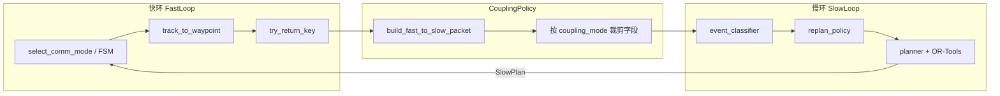

# 耦合机制实现对比与 first_test 实验问题分析

> 实验标签：`coupling_goal_trace/first_test`  
> Sweep 配置：`configs/sweeps/paper1_axis_grid_coupling_diag_c2g2.yaml`  
> 场景：`g2_cluster_m2`（120 POI），cases：`c1_g2_m2` / `c2_g2_m2`  
> 固定：`struct=fdlc`，`modeling=comm_energy_aware_decision`  
> 生成日期：2026-05-25

---

## 1. 实验背景

在完成 struct 轴 P0 稳定化（`all_P0`：FDLC > WCDL > CDSL）后，进入 **§4.2.2 耦合机制** 有效性验证。

耦合轴采用 **单轴消融（3+3+3 设计）**：每次只变 `paper1.coupling`，固定 FDLC 架构与联合建模（`comm_energy_aware_decision`），对比三档：

| 论文档位 | 仓库键 | 含义 |
|----------|--------|------|
| PeriodicGoal | `periodic_goal` | 慢环仅周期更新目标；快环固定执行 |
| EventDrivenGoal | `event_driven_goal` | 慢环事件驱动重规划 + 部分快→慢反馈 |
| FullCoupling | `full_coupling` | 慢环事件 replan + 全量快→慢反馈 + 快环 FSM 自适应 |

**主要产物：**

| 文件 | 路径 |
|------|------|
| 汇总指标 | `runs/debug/coupling_goal_trace/first_test/summary.csv` |
| 轨迹 mosaic | `runs/debug/coupling_goal_trace/first_test/plot_trajectory/mosaic_scene__g2_cluster_m2__ep0.png` |
| 各 leaf diag | `runs/debug/coupling_goal_trace/first_test/<case>__coupling_*/Ts40/seed0/diag.jsonl` |

**Sweep 参数：** `episodes=5`，`seeds=[0]`，`slow_interval_steps=40`（Ts=40）。

---

## 2. 三档耦合机制实现细节对比

### 2.1 配置入口（YAML + preset）

三档系统定义：

- `configs/experiments/paper1/system/coupling_periodic_goal.yaml`
- `configs/experiments/paper1/system/coupling_event_driven_goal.yaml`
- `configs/experiments/paper1/system/coupling_full_coupling.yaml`

预设字典：`src/uavlab/experiments/presets.py` → `COUPLING_VARIANT_PRESETS`（与 YAML 一致）。

加载路径：`load_resolved_config` → `apply_experiment_presets(cfg)` → `Paper1ContractConfig.from_cfg(cfg)`。

### 2.2 参数对照表（实现层）

| 维度 | `periodic_goal` | `event_driven_goal` | `full_coupling` |
|------|-----------------|---------------------|-----------------|
| **experiment.paper1** | fdlc + comm_energy + periodic_goal | 同左 + event_driven_goal | 同左 + full_coupling |
| **`coupling_mode`** | `periodic_goal` | `event_driven_goal` | `full_coupling` |
| **`enable_event_feedback`** | `false` | `true` | `true` |
| **`enable_fast_mode_switch`** | `false` | `false` | `true` |
| **`allow_mode_switching`** | `false` | `false` | `true` |
| **慢环 `replan_trigger_policy`** | **`periodic`** | **`event`** | **`event`** |
| **`periodic_replan_scope`** | `repeat` | `repeat` | `repeat` |
| **`slow_policy`** | `periodic_or_event_replan` | 同左 | 同左 |
| **`env.fast_upload_mode`** | `fixed` | `fixed` | **`policy`** |
| **`env.fixed_send_ratio`** | `0.5` | `0.5` | —（policy 下不用） |

### 2.3 快→慢反馈字段（`fast_to_slow`）

| 字段 | periodic | event | full |
|------|----------|-------|------|
| `send_completion` | false | true | true |
| `send_link_stats` | none | full | full |
| `send_backlog` | false | false | **true** |
| `send_mode` | false | false | **true** |
| `send_safety_events` | false | true | true |

### 2.4 运行时行为链



#### 2.4.1 `CouplingPolicy`（`src/uavlab/paper1/coupling/coupling_policy.py`）

按 `contract.coupling_mode` 在组包后**硬裁剪** `FastToSlowPacket`：

| `coupling_mode` | 慢环实际收到的 packet |
|-----------------|----------------------|
| `periodic_goal` | 仅 `step` / `goal_id` / `goal_ne`（completion、link、backlog、mode、safety 全为 `None`） |
| `event_driven_goal` | completion + link + safety；**无** backlog、mode |
| `full_coupling` | 上述字段按 `fast_to_slow` 全开（含 backlog、mode） |

`enable_event_feedback=false` 时（periodic 路径），即使 YAML 误开字段，也会在 contract 层强制关闭事件语义。

#### 2.4.2 慢环 replan（`src/uavlab/paper1/loops/slow/slow_loop.py`）

- **`replan_trigger_policy=periodic`**：仅在 `_periodic_tick`（`steps % slow_interval_steps == 0` 或 bootstrap）时 replan；**不处理**快→慢事件（packet 本身也为空）。
- **`replan_trigger_policy=event`**：由 `event_classifier` + `replan_policy` 决定；响应 goal 完成边沿、safety/energy（Critical）、link/control（Warning，P0 后延迟到 periodic tick）等。
- 三档共用 `base.yaml` 中的 P0 参数（`replan_cooldown_s`、`event_levels`、`suppress_link_interrupt_in_back` 等），**但 coupling YAML 未单独覆盖**；full/event 的慢环触发策略均为 `event`，与 struct FDLC 的 `hybrid` 不同。

#### 2.4.3 快环执行（`src/uavlab/paper1/loops/fast/`）

| 档位 | 通信模式 | 上传行为 |
|------|----------|----------|
| periodic / event | `allow_mode_switching=false` → FSM 冻结或仅 INS | `fast_upload_mode=fixed`：`fixed_send_ratio=0.5` 占空比门控进入 Stx |
| full | `enable_fast_mode_switch=true` → S_ins / S_tx / S_rec / S_back（能量） | `fast_upload_mode=policy`：链路弱时 S_rec，覆盖后待回传时 S_tx/S_rec 自适应 |

返航与 key 回传：`runner/return_scheduling.py` 的 `should_attempt_key_return` 受 `enable_fast_mode_switch` 影响；full 在覆盖后更积极尝试回传。

### 2.5 与 struct 轴 FDLC 的差异

| 项 | struct 轴 `struct_full_dual_loop_distributed.yaml` | coupling 轴 `coupling_full_coupling.yaml` |
|----|---------------------------------------------------|-------------------------------------------|
| 架构 profile | FDLC struct_profile（候选窗/能量裕度等） | 同（preset 固定 fdlc） |
| 慢环 replan | **`hybrid`** | **`event`** |
| P0 事件参数 | struct YAML 显式 `event_levels` / `replan_cooldown_s` | 继承 `base.yaml`，coupling YAML 未写 |
| 实验目的 | 比「谁决策」 | 比「快慢环如何闭环」 |

---

## 3. first_test 定量结果

### 3.1 summary.csv（5 episodes 均值，seed=0）

| Case | periodic | event | full | 论文预期 |
|------|----------|-------|------|----------|
| **C1** R_cov | 58.0% | **59.0%** | 58.3% | full 最高 |
| **C2** R_cov | **57.7%** ±0.7% | 57.0% ±3.9% | 56.5% ±4.6% | full 最高 |

**共同健康指标：**

- `R_fail_given_cov = 0`（覆盖 POI 均有效回传）
- `term_return_rate = 1.0`（全部正常返航结束）
- 5 个 episode 的 metrics 中均无「覆盖但未回传」POI

**次要指标（C2）：**

| 档位 | T_nf (s) | remaining_energy | link_recovery 次数 |
|------|----------|------------------|-------------------|
| periodic | 412 | **0.227** | 4.4 |
| event | 356 | 0.104 | 5.0 |
| full | 349 | 0.103 | 4.8 |

periodic 剩余能量最高（上传/机动开销更低），但覆盖率并未因此下降。

### 3.2 C2 ep0 POI 集合重叠

| 指标 | 值 |
|------|-----|
| 三档共有 POI | **66** |
| periodic 独有 | 1 |
| event / full 独有 | 0 |
| full vs periodic Jaccard | **0.93** |

三种耦合在 ep0 访问的 POI 集合高度重合，指标差异被「同一条路」抹平。

### 3.3 diag.jsonl：replan 与 goal 行为（C2 ep0，10000 steps，Ts=40）

| 档位 | replan 次数 | 不同 goal 数 | goal 振荡 (A→B→A) |
|------|------------|-------------|-------------------|
| periodic | 379 | 72 | **0** |
| event | 405 | **102** | **0** |
| full | 403 | 82 | **30** |

- **periodic 并非「不重规划」**：`periodic` + `repeat` + Ts=40 → 约 **250+ 次定时 replan**，整个 episode 内慢环持续滚动优化。
- **event 的 unique goal 最多（102）**：链路/完成事件触发更多目标切换，但未转化为更高覆盖。
- **full 存在 goal 振荡**（如 41↔37、25↔24），与 struct 轴 P0 后 FDLC 的稳定表现不一致；coupling full 使用纯 `event` replan，未继承 struct YAML 的 `hybrid`。

### 3.4 分 episode 方差（C2 full_coupling）

| ep | R_cov | covered POI 数 |
|----|-------|----------------|
| 0 | 59.2% | 71 |
| 1–3 | 58.3% | 70 |
| **4** | **48.3%** | **58** |

单次离群 episode 拉低 full 均值并放大标准差；event 亦有 ep1=50% 的回落。

---

## 4. 轨迹 mosaic 观察（ep0）

**C1（上行）：** 三列轨迹几乎重合——右上 + 中上 cluster 变绿，左侧/下方大量未访问。弱通信档位（C1）不足以拉开耦合差异。

**C2（下行）：**

- **periodic**：轨迹最「保守」，较少探右下 cluster。
- **event / full**：多一段右下 cluster 的探路，但 ep0 最终覆盖集与 periodic 仍高度重叠（共有 66 POI）。
- 三档均未覆盖地图左侧 cluster——属于**时间/能量预算**下的可达性上限，非某一档独有故障。

---

## 5. 核心结论（Executive Summary）

| 维度 | 结论 |
|------|------|
| 论文叙事 | **未成立**：未观察到 full > event > periodic；C2 上 periodic 略优且更稳 |
| 系统健康 | **成立**：全覆盖 POI 有效回传、正常返航，无崩溃 |
| 根因层级 | 主要不在 planner/建模，而在 **对照强度不足** + **三档慢环 replan 频率过高趋同** |
| event vs full | 慢环同为 `event` replan，差异主要在快环 fixed 50% vs FSM；marginal gain 小 |
| 与 struct 轴 | coupling full（~56% C2）与 struct FDLC all_P0（~55%）同量级，**耦合增量未体现** |

**一句话：** first_test 说明在「FDLC + 联合建模 + Ts=40 高频周期 replan」底座上，三档耦合机制的**可观测差异过小**；periodic 因无事件噪声、无 goal 振荡，反而在 C2 上略稳略高。

---

## 6. 暴露问题分层分析

### 6.1 实验设计层

**问题 A：`periodic_goal` 不是真正的「无反馈 / 开环慢环」**

- `replan_trigger_policy: periodic` + `periodic_replan_scope: repeat` + Ts=40  
- 实测 **~379 次 replan / episode**，慢环仍在持续 OR-Tools 重算  
- 「关闭快→慢反馈」的效果被 **高频定时 replan** 部分抵消

**问题 B：event 与 full 在慢环侧过于同构**

- 二者均为 `replan_trigger_policy: event`  
- 差异仅在于 packet 是否含 backlog/mode，以及快环 fixed vs FSM  
- P0 事件分级对 link 事件为 Warning（延迟 replan），进一步缩小 event/full 与 periodic 在「有效 replan 次数」上的差距

**问题 C：C1 ≈ C2，通信档位未形成压力**

- 三档在 C1/C2 的 R_cov 差距 < 2pp  
- C2 局部遮挡未使「链路反馈 + 快环自适应」成为瓶颈

### 6.2 参数 / 实现层

**问题 D：`fixed_send_ratio=0.5` 可能过 generous**

- periodic / event 在 cluster 内 50% 占空上传，对 g2_m2 可能已足够  
- 削弱了 full FSM（S_tx/S_rec）相对 fixed 的边际收益

**问题 E：full coupling 的 goal 振荡与 ep 方差**

- C2 ep0：30 次 A→B→A 振荡；ep4 覆盖跌至 48.3%  
- coupling `full_coupling.yaml` 使用纯 `event` replan，**未**采用 struct FDLC 的 `hybrid` + 显式 P0 参数

**问题 F：场景饱和**

- 右 cluster 主导可行域；左侧 cluster 对所有档位均不可达  
- 三档在 ~57–59% 覆盖平台上竞争，差异落在噪声区间

### 6.3 预期 vs 实测对照

| 论文假设 | first_test 实测 |
|----------|-----------------|
| 无反馈 → 覆盖最低 | periodic 并非最低 |
| 事件驱动 → 中等 | event 与 full/periodic 打平 |
| 全耦合 → 覆盖最高 | full 略低且方差最大 |
| C2 拉大耦合差距 | C1 ≈ C2 |

---

## 7. 后续建议（按优先级）

### 7.1 拉大对照强度（推荐先做）

1. **加强 periodic 的「弱耦合」**  
   - `periodic_replan_scope: init_only`（仅初始规划），或  
   - 增大 `slow_interval_steps`（如 200 / 400）

2. **削弱 fixed 上传**  
   - 降低 `fixed_send_ratio`（如 0.2），使 event/full 的快环优势可观测

3. **场景加压**  
   - 主场景聚焦 **C2 + g2_m1/m2**；C1 作补充  
   - 可选：更紧能量预算或更长 episode（若需覆盖左侧 cluster）

### 7.2 对齐 struct P0 稳定参数（可选）

- 在 `coupling_full_coupling.yaml` / `rt event 中显式写入：  
  `replan_trigger_policy: hybrid`、`event_levels`、`replan_cooldown_s`  
- 目标：降低 full 的 goal 振荡与 ep 离群，而非提高 periodic

### 7.3 统计与报告

- 增加 `seeds: [1, 2]`，报告分 episode 分布  
- 除 R_cov 外，报告 **replan 原因分布、S_rec 占比、link_recovery 延迟、remaining_energy** 作为耦合机制次要证据

### 7.4 若接受「本场景 R_cov 梯度有限」

可在论文中如实陈述：在 g2_m2 + Ts=40 下三档覆盖接近；耦合差异主要体现在 **能耗、链路恢复、replan 稳定性**，而非主指标 R_cov。

---

## 8. 复现实验命令

```bash
# Sweep
PYTHONPATH=src python3 scripts/sweep.py \
  --plan configs/sweeps/paper1_axis_grid_coupling_diag_c2g2.yaml

# Mosaic（示例）
PYTHONPATH=src python3 -m uavlab.viz.plot_trajectory \
  --sweep_root runs/debug/coupling_goal_trace/first_test \
  --scene configs/scenes/g2_cluster_m2.yaml \
  --episode 0 \
  --out runs/debug/coupling_goal_trace/first_test/plot_trajectory
```

---

## 9. 相关代码与配置索引

| 类别 | 路径 |
|------|------|
| 耦合三档 YAML | `configs/experiments/paper1/system/coupling_*.yaml` |
| 预设 | `src/uavlab/experiments/presets.py` → `COUPLING_VARIANT_PRESETS` |
| 快→慢组包 | `src/uavlab/paper1/coupling/coupling_policy.py` |
| 慢环 replan | `src/uavlab/paper1/loops/slow/slow_loop.py` |
| 事件分级 / cooldown | `loops/slow/event_classifier.py`, `replan_policy.py` |
| 快环 FSM | `src/uavlab/paper1/loops/fast/fsm.py`, `fast_loop.py` |
| 诊断 sweep | `configs/sweeps/paper1_axis_grid_coupling_diag_c2g2.yaml`（v1） |
| **coupling_v2 sweep** | `configs/sweeps/paper1_axis_grid_coupling_v2.yaml` |
| C2-hard case | `configs/experiments/paper1/cases/c2_hard_g2_m2.yaml` |
| v2 设计文档 | `docs/coupling_v2_design.md` |
| 实验指南 | `docs/experiments_baseline_guide.md` §3.3 |
| struct 轴对照 | `docs/struct_a_diff_v2_experiment_issues.md`, `runs/debug/struct_goal_trace/all_P0/` |

---

## 10. 修订记录

| 日期 | 说明 |
|------|------|
| 2026-05-25 | 初版：基于 `coupling_goal_trace/first_test` 结果整理实现对比与问题分析 |
| 2026-05-25 | v2：见 [`coupling_v2_design.md`](coupling_v2_design.md) 与 `paper1_axis_grid_coupling_v2.yaml` |
