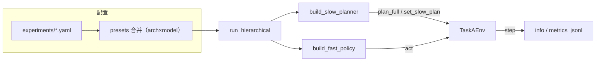

# TaskA 对比实验：Baseline 切换与训练 / 推理全流程指南

本文档说明如何在 **同一套代码与指标口径** 下，通过 **配置文件边界** 切换 `docs/model_design.md` §13 中的主 baseline、消融与附加实验，并完成 **快环 PPO 训练** 与 **双环层次推理**。实现细节见 `uavlab/experiments/presets.py`（**论文一**：`experiment.paper1.struct` × `experiment.paper1.modeling` + 可选 `paper1.coupling`；**附录/论文二**：`experiment.paper2.ablation`）与 `uavlab/policies/registry.py`（慢环 / 快环后端）。

---
### FAQ：快环 PPO 的五维动作是什么？

快环 PPO 策略（即 `SB3PPOFastPolicy`）输出的 **5 维动作** 含义如下：

1. **目标点 N 向偏移 ΔN**（归一化比例，通常范围 \[-1, 1\]）  
   - 控制 UAV 在下一个局部路径点的北向位置增量。

2. **目标点 E 向偏移 ΔE**（归一化比例，通常范围 \[-1, 1\]）  
   - 控制 UAV 在下一个局部路径点的东向位置增量。

3. **是否高优先级上传**（二值/概率，sigmoid 激活，取 1 表示高优先级任务上传）  
   - 判定当前时刻是否立即主动上传高优先级信息。

4. **是否等待/悬停**（二值/概率，sigmoid 激活，取 1 表示 UAV 选择短暂停留/等待）  
   - 控制 UAV 是否在当前位置暂停一小段时间。

5. **是否强制缓存**（二值/概率，sigmoid 激活，取 1 表示主动进入数据缓存模式）  
   - 决定 UAV 是否短期内不上传，优先缓存采集到的信息。

> **说明**：这 5 维动作在 `uavlab/policies/fast/sb3_policy.py` 的 `policy.act()` 及相应环境 `step()` 实现中被分别解释为定位微调与局部决策控制，其中前三维通常是位置/上传决策，后两维为等待与缓存动作，允许连续/概率输出并在主程序中采样或阈值判定。

如需进一步理解，可以参考《docs/求解路线选择建议.md》 §7.2、§13，或查阅源码 `src/uavlab/policies/fast/random_policy.py` 和 `src/uavlab/policies/fast/sb3_policy.py` 的注释和动作分解逻辑。


## 1. 先理清三条「入口线」

| 入口 | 脚本 | 慢环 `HeuristicSlowPlanner` | 快环 |
|------|------|----------------------------|------|
| **快环训练** | `python -m uavlab.tasks.taskA.train_fast_loop_ppo --config <yaml>` | **不参与**环境内每步规划；`paper1.struct` / `paper1.modeling` 仍可能影响 **env/comm**（如 `fast_upload_mode`、`waypoint_delta_max`） | **PPO 学习** 5 维动作 |
| **双环推理（论文主表）** | `python -m uavlab.tasks.taskA.run_hierarchical --config <yaml> [--fast_model <ppo.zip>]` | **每局 / 每 `slow_interval_steps` 步** `plan_full` → `set_slow_plan` | `random` / `sb3`（或 CLI 覆盖 checkpoint） |
| **仅快环 rollout（调试用）** | `python -m uavlab.tasks.taskA.eval_fast_loop_ppo --model ...` | **不调用** | 加载 PPO |

**重要**：主表对比 **Ours vs B1/B3**（及建模/耦合消融）的「决策差异」在 **层次推理** 中最完整；训练阶段各 baseline 主要差在 **环境侧对上传与能耗的设定**（见 §4），用于得到 **可在各设定下公平加载** 的快环策略。

---

## 2. 配置如何被解析（切换 baseline 的「边界」）

单文件 YAML 的加载顺序：

1. **`load_resolved_config(path)`**  
   - 若根节点含 `extends: ../base.yaml`（或 `extends: ["../base.yaml", ...]`），则 **先加载基座** 再 **深度合并** 当前文件（`extends` 键本身不进入结果）。  
   - 所有 `configs/experiments/*.yaml` 均建议继承 `configs/base.yaml`。

2. **`apply_experiment_presets(cfg)`**（在 `train_fast_loop_ppo` / `run_hierarchical` 内自动调用）  
   - **论文一**：读取 `experiment.paper1.struct` 与 `paper1.modeling`，依次合并 `ARCH_VARIANT_PRESETS` 与 `MODEL_VARIANT_PRESETS`；可选再合并 `paper1.coupling` → `COUPLING_VARIANT_PRESETS`。  
   - **附录/论文二工程消融**：读取 `experiment.paper2.ablation`（**不可**与 `paper1` 预设轴同时出现）。  
   - 若上述字段都缺省 → **不追加**预设。

因此：**切换实验条件 = 换一份 `configs/experiments/<name>.yaml`**（或只改其中的 `paper1.struct` / `paper1.modeling` / `paper1.coupling`），**不要**在多个地方手改分散参数，避免与预设不一致。

---

## 3. 论文一：`paper1.struct` × `paper1.modeling`（+ 可选 `paper1.coupling`）

### 3.1 `paper1.struct`（结构对比，§4 / §6.3.1；建模固定为 `comm_energy_aware_decision`）

**统一慢环（三档相同）**：`slow_policy=periodic_or_event_replan`，`replan_trigger_policy=hybrid`（周期 + 事件），`enable_event_feedback=true`，`fast_to_slow` 全字段；`coupling=full_coupling` 仅为控制变量标签。

**仅快环决策能力不同**：

| `paper1.struct` | 快环操作化 |
|---|---|
| `cdsl` | 跟踪 + 固定上传；`use_comm/energy_in_fast=false`；无航点微偏、无 FSM |
| `wcdl` | 航点微偏 + 固定上传；快环无链路 FSM（`use_comm_in_fast=false`）、无 S_back；通信感知在慢环；`fast_upload_mode=fixed` |
| `fdlc` | 全 FSM（含 S_back）+ 航点微偏；`fast_upload_mode=policy` |

**旧键（仍被 `normalize_paper1_struct` 接受）**：`b1_centralized_single_loop` → `cdsl`，`b3_decouple_dual_loop` → `wcdl`，`full_architecture` → `fdlc`。

### 3.2 `paper1.modeling`（信息利用消融，§4；结构固定 `fdlc`，耦合固定 `full_coupling`）

| `paper1.modeling` | 论文 | 慢环 | 快环 |
|---|---|---|---|
| `comm_aware_decision` | Communication-aware | 通信适宜度 + 控制链路掩码；`energy_constraint: none` | Stx/Srec 链路自适应；无低电量返航 |
| `energy_aware_decision` | Energy-aware | 能量可达 + 巡游预算；无通信掩码/目标 | 低电量返航；无链路自适应回传 |
| `comm_energy_aware_decision` | Communication & Energy-aware | 通信 + 能量联合 | 链路自适应 + 返航 |

实现：`paper1_loops.semantics` 的 `use_comm_in_slow/fast`、`use_energy_in_slow/fast` 与 `modeling.*` 同步（见 `presets.py`）。

### 3.3 `paper1.coupling`（耦合机制三档，§4.2.2；需 `struct=fdlc` 且 `modeling=comm_energy_aware_decision`）

论文只保留 **三条耦合机制轴**；仓库用同名 preset + `configs/experiments/paper1/system/coupling_*.yaml` 固定整包参数（`replan_trigger_policy`、`periodic_replan_scope`、`semantics`、`fast_to_slow`、`env.fast_upload_mode`、`allow_mode_switching` 等），避免审稿人误以为还在扫第四条无关开关。

| `paper1.coupling` | 论文机制 | 要点（coupling_v2 YAML） |
|---|---|---|
| `periodic_goal` | PeriodicGoal | `replan_trigger_policy=periodic`；**Ts=200**（`experiment.sweep.slow_interval_steps`）；`fixed_send_ratio=0.2`；无 f2s |
| `event_driven_goal` | EventDrivenGoal | **`replan_trigger_policy=hybrid`** + P0 事件分级；`fixed_send_ratio=0.2`；f2s 无 backlog/mode |
| `full_coupling` | FullCoupling | **`hybrid` + P0**；`fast_upload_mode=policy`；全量 f2s + FSM |

主 sweep：`configs/sweeps/paper1_axis_grid_coupling_v2.yaml`（含 `c2_hard_g2_m2`）。诊断脚本：`scripts/analyze_coupling_diag.py`。详见 [`docs/coupling_v2_design.md`](coupling_v2_design.md)。

**实现层旧名 → 论文三档（`Paper1ContractConfig.normalize_paper1_coupling_mode`）**：`no_feedback` → `periodic_goal`；`no_fast_switching` → `event_driven_goal`。`no_replan` 仍作为 **SlowLoop** 内部变体保留（与「耦合机制」轴解耦），不在主扫耦合轴中出现。

### 3.4 `paper2.ablation`（附录/论文二；不要与 `paper1` 预设轴混用）

| `paper2.ablation` | 论文位置 | 关键操作化 |
|---|---|---|
| `ablation_no_link_adapt` | §13.3 Ablation-A | `env.fast_upload_mode=fixed`（固定上传强度） |
| `ablation_b_no_poi_drop` | §13.3 Ablation-B | `slow_loop.enforce_energy_hard_constraint=false` |

源码：`src/uavlab/experiments/presets.py`。

---

## 4. 问题 1：如何有边界地切换不同 baseline 做训练与推理

### 4.1 原则（「边界」指什么）

1. **一条实验 = 一个实验 YAML**（仓库已提供 `configs/experiments/*.yaml`），通过 **`experiment.id` + `paper1.*`（或 `paper2.ablation`）** 标识，便于目录与论文对应。  
2. **同一次对比** 尽量固定：`scene_file`、`train.seed`、`train.total_timesteps`（或明确记录差异）、`train.comm_mode`（除非专门做退化 / 理想对照）。  
3. **训练产物分目录**：`train_fast_loop_ppo.py` 默认 `run_root/run_name`；未设 `train.run_name` 时使用 **`experiment.id`**，避免不同 baseline 互相覆盖。  
4. **推理时** 使用 **同一份实验 YAML** + **该 baseline 下训练出的** `ppo_final.zip` 或 `best_model.zip`，再叠加层次慢环，保证「环境设定与论文一致」。

### 4.2 训练：切换 baseline

在仓库根目录，确保 `PYTHONPATH=src`（或等价安装包）。

```bash
# 示例：Ours
PYTHONPATH=src python3 -m uavlab.tasks.taskA.train_fast_loop_ppo --config configs/experiments/ours.yaml

# 示例：弱耦合双环（原 Baseline-3 配置）
PYTHONPATH=src python3 -m uavlab.tasks.taskA.train_fast_loop_ppo --config configs/experiments/paper1/runs/struct_decoupled_dual_loop__c2_g2_m1.yaml
```

输出示例路径：

```text
runs/taskA_ppo_fast/<experiment.id>/ppo_final.zip
runs/taskA_ppo_fast/<experiment.id>/resolved_config.yaml
```

切换 baseline **只需改 `--config` 路径**；无需改 Python 代码。

可选：在某一实验 YAML 内设置 `train.run_name` 覆盖默认的 `experiment.id`，或设置 `train.run_root` 统一归档到例如 `runs/ablation_202603/`。

### 4.3 推理（双环）：切换 baseline + 挂载训练好的快环

```bash
PYTHONPATH=src python3 -m uavlab.tasks.taskA.run_hierarchical \
  --config configs/experiments/ours.yaml \
  --fast_model runs/taskA_ppo_fast/ours/best/best_model.zip \
  --episodes 30 \
  --metrics_jsonl runs/metrics/ours_hier.jsonl
```

- **`--config`**：必须与该次要报告的 baseline **一致**（与训练时相同最佳）。  
- **`--fast_model`**：指向 **该 baseline 下** 训练的 PPO；若留空，则使用 YAML 中 `fast_loop`（默认可为 `random`，一般仅作冒烟）。  
- **`--comm_mode`**：留空则使用配置里的 `train.comm_mode`；跨「理想链路训练 → 退化测试」时可显式传 `degraded`。  

切换 baseline：**换 `--config` + 换对应 `--fast_model` 权重路径**。

### 4.4 附加实验：理想环境训练（§13.4）

使用 `configs/experiments/paper2/extra_ideal_train_transfer.yaml`（已将 `train.comm_mode` 设为 `baseline`）训练快环，再在 **退化** 配置下做层次测试，用于泛化讨论而非主表公平对比。

### 4.5 混合慢环（`hybrid_rl_score`）

与双轴预设 **独立**：需在 YAML 中设 `slow_loop.backend: hybrid_rl_score` 及 `checkpoint`（见 `docs/experiments_taskA.md` §0）。训练打分网络与层次推理命令以该文档为准。

---

## 5. 仓库内预置实验文件一览

| 文件 | 用途 |
|------|------|
| `configs/experiments/ours.yaml` | 完整方法（Ours） |
| `configs/experiments/paper1/runs/struct_centralized_single_loop__c2_g2_m1.yaml` | Baseline-1（§6.3.1） |
| `configs/experiments/paper1/runs/struct_decoupled_dual_loop__c2_g2_m1.yaml` | 弱耦合双环 Baseline（§6.3.1） |
| `configs/experiments/paper1/runs/struct_full_dual_loop_distributed__c2_g2_m1.yaml` | Proposed 完整结构（§6.3.1） |
| `configs/experiments/paper2/ablation_no_link_adapt.yaml` | Ablation-A |
| `configs/experiments/paper2/ablation_b_no_poi_drop.yaml` | Ablation-B（与 B3 预设相同，独立 `experiment.id`） |
| `configs/experiments/paper2/extra_ideal_train_transfer.yaml` | 理想链路训练（附加） |
| `configs/experiments/paper1/hybrid_rl_slow.yaml` | 混合慢环（需 `scorer.pt`） |

新增实验：**复制上述任一样式**，改 `experiment.id` 与 `paper1.struct` / `paper1.modeling`（及可选 `paper1.coupling`）；若需新预设，在 `presets.py` 的 `ARCH_VARIANT_PRESETS` / `MODEL_VARIANT_PRESETS` / `COUPLING_VARIANT_PRESETS`（或 `LEGACY_ABLATION_PRESETS`）中增加一项并在文档中登记。

---

## 6. 公平对比检查清单（建议打印或贴进实验笔记）

- [ ] 各 baseline 使用 **各自** `resolved_config.yaml` 或保存的 `runs/.../resolved_config.yaml` 存档。  
- [ ] `train.comm_mode`、`scene_file`、`episode_steps` 在主表中一致或有意记录差异。  
- [ ] 层次推理时 **`--config` 与训练时 baseline 一致**，`--fast_model` 来自 **同 id 目录**。  
- [ ] 随机种子：`train.seed` 固定；`run_hierarchical --seed` 固定。  
- [ ] 指标：使用 `--metrics_jsonl` 统一汇总，字段含 `experiment_id`（来自配置）。

---

## 7. 数据流简图（层次推理）



---

## 8. 相关文档与源码

| 说明 | 路径 |
|------|------|
| 实验设计与 baseline 定义 | `docs/model_design.md` §12–§15 |
| TaskA 实验简版（含混合慢环训练命令） | `docs/experiments_taskA.md` |
| 预设键与合并逻辑 | `src/uavlab/experiments/presets.py` |
| 配置 `extends` 与 `load_resolved_config` | `src/uavlab/common/config.py` |
| 慢环 / 快环工厂 | `src/uavlab/policies/registry.py` |
| 层次推理入口 | `src/uavlab/tasks/taskA/run_hierarchical.py` |
| 快环训练入口 | `src/uavlab/tasks/taskA/train_fast_loop_ppo.py` |

---

## 9. 常见问题

**Q：为什么训练时看不到慢环在每个 episode 里选 POI？**  
A：`train_fast_loop_ppo.py` 当前只在 **TaskAEnv** 上训练 PPO，**不** 内嵌 `plan_full` 循环；POI 相关行为主要在 **层次推理** 中体现。`paper1.struct` / `paper1.modeling` 仍可能改变 **env/comm**（如固定上传、关闭航点微调），从而影响训练分布。

**Q：B1 与 Ablation-A 配置几乎一样？**  
A：是的，二者在预设中 **操作化相同**（固定 `send_ratio`），论文中叙述角度不同；若需区分，可在未来增加仅标签不同的 `experiment.paper_ref` 或细分 `env` 参数。

**Q：能否只用一个 `base.yaml` 手动改参数而不建 experiments 文件？**  
A：可以，但不推荐；容易遗漏 `apply_experiment_presets`，且 **无法** 用 `experiment.id` 自动分目录存档。
