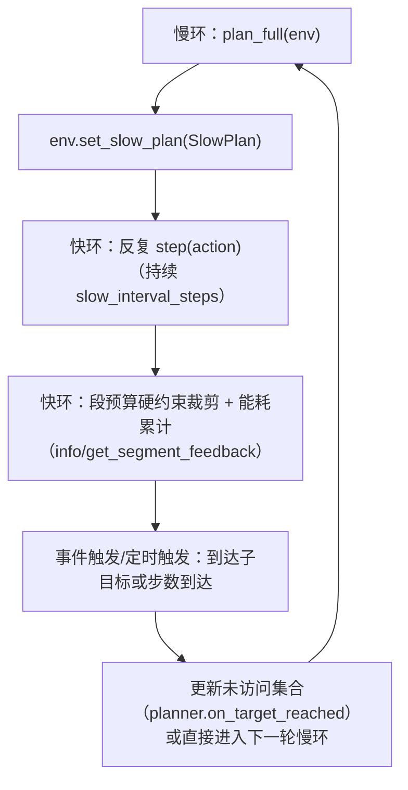

# 快环 / 慢环升级设计

## 0. 任务背景：无人机巡检

本设计服务于 **无人机巡检**：在多个任务点（POI）间规划路径并完成 **任务数据回传**（可对应图像/视频/检测结果的抽象 chunk）。机载侧主要依赖 **GPS**（位置/速度）、**IMU**（姿态/融合）、**地图几何摘要**（最近禁飞边界距离/方向，由场景 YAML 与几何计算得到）、**通信模块**（控制/状态闭环 + 任务数据上行，见 `docs/dual_link_metrics_design.md`）；高价值数据以 **key 数据队列** 抽象。  
**传感器与观测的逐项映射**见 `docs/experimental_design_simulation_evaluation.md` 第 2 节。

### 0.1 接口 vs 策略 vs 训练入口（概念厘清）

为避免「`step` 像强化学习、设计里又说快慢环不必用 RL」的混淆，下表将三者分开：**仿真接口**、**各层策略（谁产生动作/子目标）**、**脚本入口（是否训练、是否层次闭环）**——它们相互独立。

| 维度 | 含义 | 本仓库中的典型实现 |
|------|------|---------------------|
| **接口** | 环境与外部调用方的契约：一步仿真如何被驱动、返回什么量 | **`TaskAEnv`**：`reset()` / `step(action) → obs, reward, terminated, truncated, info`（Gymnasium 风格）。这是**通用仿真壳**，不隐含「必须用神经网络」。 |
| **策略** | **快环**：谁给出每步的 5 维量（或内部等价量）；**慢环**：谁更新全局子目标与数据策略 | **快环**：`fast_loop_mode=ppo` 时由 **PPO** 等输出 `action`；`classical` 时由 **LocalPathPID + UploadFSM** 在 env 内**自行计算**，可忽略传入的 `action`。**慢环**：当前 **`HeuristicSlowPlanner`**（启发式，非 RL）；设计上可替换为优化器或未来 **GCS 侧 RL**。 |
| **训练入口** | 哪个脚本在跑：是否调用 `learn`、是否接慢环周期性 `plan` | **`train_fast_loop_ppo.py`**：默认只训练 **快环 PPO**，通常**不显式**跑层次慢环。**`run_hierarchical.py`**：慢环按间隔 `plan` + `set_target` / `set_data_strategy`，快环用已加载 PPO 或随机。**纯评估/经典快环**：可不训练，只 `step` 滚动仿真。 |

**一句话**：`step`/`reset` 定义的是**仿真与观测–动作空间**；**RL 只是快环策略的一种可选实现** + **`train_fast_loop_ppo.py` 提供的一种实验入口**；慢环当前实现以**启发式**为主，与设计文档「可不使用 RL」一致。

---

## 1. 快环（局部航迹 + 上传微调）

- **时间尺度**：秒级 / 单步决策
- **角色**：局部规划器，输出航点微调、速度设定与高价值数据上传动作；底层控制（速度跟踪）由动力学/飞控完成。

### 1.1 输入（观测）

| 类别 | 维度/内容 |
|------|-----------|
| **UAV 当前状态** | 位置 (n,e)、速度 (Vn,Ve)、航向 (yaw_sin, yaw_cos)、电量 (battery_ratio) |
| **局部链路状态** | 延迟 (mean_delay_s)、丢包 (per/pdr)、带宽 (bw_utilization)、队列长度、aoi、l_out |
| **局部任务点信息** | 到当前子目标 (dN,dE,dirN,dirE,dist)、禁飞区 (dist_nf, dir_nf)、高价值数据待传数 (key_pending)、未完成任务侧写 (local_len, inflight_len, key_delivery_ratio) |
| **地图几何（无射线维）** | 最近禁飞：`dist_nf`, `dir_nf`（障碍/边界由 env 碰撞与场景几何判定） |
| **能耗预算（可选扩展）** | 若启用能耗约束观测扩展，会追加任务段预算剩余比例（绕行/等待）与局部代价估计等 3 维特征（由 env 参数 `append_energy_budget_to_obs` 控制） |

### 1.2 输出（动作）

| 输出 | 含义 |
|------|------|
| **局部航点微调** | (delta_n, delta_e)，相对当前子目标的偏移（米），用于得到本步有效目标 = base_target + (delta_n, delta_e) |
| **局部速度调整** | (vn_cmd, ve_cmd)，北/东向速度设定 |
| **高优先级任务数据上传** | send_ratio ∈ [0,1]，本步用于回传的预算比例（key 优先已在 DataBuffer 中保证） |

**高价值数据判定（默认）**：在预设 **任务点半径**（`poi_list` + `key_data_radius_m`）或 **终点半径** 内采集的数据记为 key；配置项 `comm.data_key_mode: poi`（默认）或 `random`（`data_key_prob`）。详见 `docs/experimental_design_simulation_evaluation.md`。

**与 GCS 的关系**：慢环（全局顺序与上传策略）由 **GCS** 侧概念主导；快环在 **UAV** 上执行局部航迹与回传触发。场景上 **GCS 位于起降点**（`gcs_ne`，默认同 `start_ne`）。详见 **`docs/uav_gcs_collaboration.md`**。

动作空间（升级后）：`[delta_n, delta_e, vn_cmd, ve_cmd, send_ratio]`，5 维。

### 1.3 目标与指标

- **主要目标**：局部航迹安全 + 高价值数据即时回传
- **指标**（在 info 中暴露）：
  - **高价值数据成功率**：key_delivery_ratio
  - **局部航迹安全性**：无碰撞/禁飞/出界为 1，否则 0；或逐项 collision/nofly/oob
  - **链路可用性**：PDR 或 1 - loss_rate
  - **局部响应效率**：如 1/(1+mean_delay_s) 或到达子目标步数倒数

### 1.4 快环输入输出图

```mermaid
flowchart LR
    subgraph Obs["快环输入（由 env 组织）"]
        O1["导航/子目标向量 dN,dE,dirN,dirE"]
        O2["速度 Vn,Ve 与航向 yaw_sin,yaw_cos"]
        O3["禁飞几何 dist_nf, dir_nf"]
        O4["通信统计：mean_delay_s, pdr, aoi, l_out, ..."]
        O5["数据侧队列：local_len, inflight_len, key_delivery_ratio"]
        O6["能耗预算观测（可选 3 维）：绕行/等待剩余比例与代价估计"]
    end

    subgraph Policy["快环策略/控制器"]
        P1["输入观测 -> 输出 5 维动作"]
        A["动作 a = (delta_n, delta_e, vn_cmd, ve_cmd, send_ratio)"]
    end

    subgraph Env["TaskAEnv.step(a)"]
        E1["effective_target = base_target + (delta_n, delta_e)"]
        E2["段预算硬约束裁剪：绕行/等待/低电量上传强度"]
        E3["控制链路更新：vn_set, ve_set（受通信到达影响）"]
        E4["任务数据链路：Uplink(send_ratio) 回传 chunk"]
        E5["动力学更新 + 终止判断 + 写入 info 段统计"]
    end

    Obs --> P1 --> A --> E1 --> E2 --> E3 --> E4 --> E5
```

---

## 2. 慢环（全局路径规划 + 数据回传策略优化）

- **时间尺度**：分钟级 / 任务段级
- **角色**：给出全局访问顺序与数据回传策略参数，供快环与 env 使用。

### 2.1 输入

| 类别 | 内容 |
|------|------|
| **全局任务点列表** | POI 或航点列表 (poi_list) |
| **UAV 全局状态** | 当前位置、速度、电量（可选） |
| **通信链路约束** | 带宽、丢包、延迟模型（来自 channel 配置或当前快环指标） |
| **环境约束** | 障碍物/禁飞区（scene） |

### 2.2 输出

| 输出 | 含义 |
|------|------|
| **全局路径规划** | 任务点访问顺序（下一目标 waypoint / POI），即 `PlannedTarget(target_ne, radius_m, poi_id)` |
| **数据回传策略** | `DataStrategy(batch_size, compression_ratio, key_priority_ratio)`：每步最大上传 chunk 数、压缩比（预留）、高价值数据优先权重（与 key 优先策略一致时可省略） |
| **任务段执行预算（能耗硬约束，新增）** | `SegmentBudget(max_extra_detour_m, max_wait_s, min_battery_ratio)`：慢环给快环一个“本段允许的最大额外绕行/等待”和最低安全电量阈值；不可行候选会在慢环中被硬约束过滤 |

### 2.3 指标（任务段/全局）

- **累计 goodput**：TaskDataLinkMetrics.goodput_bps 在时段内积分或均值
- **数据完整率**：TaskDataLinkMetrics.completeness
- **任务数据传输经济性**：TaskDataLinkMetrics.tx_efficiency（单位有效数据开销的倒数）
- **速率稳定性**：TaskDataLinkMetrics.rate_stability

### 2.4 慢环输入输出图

```mermaid
flowchart LR
    subgraph Inputs["慢环输入（来自任务与 env 状态）"]
        I1["未访问 POI 集合 / poi_list"]
        I2["UAV 位置 env.pos（用于估计飞行代价）"]
        I3["通信统计（可选）：env.metrics.l_out"]
        I4["电量 env.battery_ratio（用于能耗硬约束可行性）"]
        I5["数据侧信息（用于等待能耗估计，可选）：env.data_buffer.local_key_len()"]
    end

    subgraph Slow["慢环规划器（Heuristic 或学习器）"]
        S1["plan_full(env)：候选 POI -> 能耗硬约束筛选"]
        S2["输出 SlowPlan = (target, data_strategy, segment_budget)"]
    end

    subgraph EnvOut["Env 下发与任务段开始"]
        U1["env.set_slow_plan(slow_plan)"]
        U2["更新：base_target / DataStrategy / SegmentBudget"]
    end

    Inputs --> S1 --> S2 --> U1 --> U2
```

---

## 3. 与 env 的对接

- **快环**：每步 `step(action)`，`action` 为 5 维；观测含 battery、mean_delay、key_pending；有效目标 = 慢环给出的 base_target + 快环的 (delta_n, delta_e)；info 中写入快环四类指标。
- **慢环**：按固定步数间隔或“到达子目标”事件调用；`plan(env)` 返回 `(PlannedTarget, DataStrategy)`（`select_next_target(env)` 仅返回 `PlannedTarget`，兼容旧调用）；env 通过 `set_target(...)` 和 `set_data_strategy(...)` 更新 base 目标与回传策略参数（如 batch_size、compression_ratio）。
 - **能耗硬约束版本（可选）**：慢环改用 `plan_full(env)` 输出 `SlowPlan(target, data_strategy, segment_budget, energy_check)`；env 通过 `set_slow_plan(slow_plan)` 同步更新目标、回传策略与任务段预算；快环内部根据预算对局部动作进行硬约束裁剪，并在 `info` 中统计段内额外绕行/等待/预算违规次数。

---
## 4. 快慢环交互合作（能耗硬约束版本）

在能耗硬约束版本中，一个典型任务段的闭环协作过程如下（与当前 `run_hierarchical` 的调用方式一致）：

协作要点：

- 慢环负责输出：
  - 下一全局子目标（`SlowPlan.target`）；
  - 数据回传包络（`SlowPlan.data_strategy`）；
  - 这一段的执行预算（`SlowPlan.segment_budget`），用于保障能耗约束可行性。
- 快环负责执行：
  - 在慢环 `base_target` 上叠加局部微调，形成本步有效目标；
  - 在每步执行前用段预算做硬裁剪（控制额外绕行距离、等待时间、低电量时的上传强度上限）；
  - 在 env 内累计段统计并写入 `info`，必要时通过 `env.get_segment_feedback()` 给下一轮慢环重规划。

