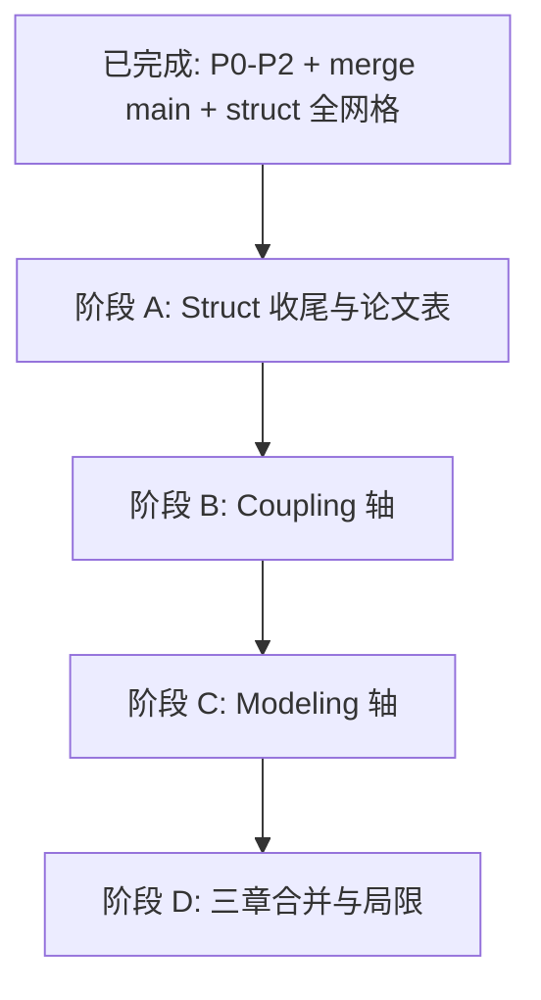

# Paper1 工作梳理与后续路线图

> **状态**：Struct 轴回传重构已合入 `main`（2026-06）  
> **主实验锚点**：C2 / `g2_cluster_m2` / 4 Mbit（`configs/comm_profiles/c2.yaml`）  
> **全网格验证**：`runs/sweeps/struct_axis_full_20260602/`  
> **关联文档**：`docs/struct_return_p0_p1_summary.md`、`docs/struct_axis_1m_4m_8mbit_analysis.md`

---

## 1. 目标与论文叙事

### 1.1 三条实验轴（控制变量）

| 轴 | `experiment.paper1` 变化 | 固定项 |
|----|--------------------------|--------|
| **结构 struct** | `struct` = cdsl / wcdl / fdlc | modeling + coupling |
| **耦合 coupling** | `coupling` = periodic / event / full | struct + modeling |
| **信息利用 modeling** | `modeling` = comm / energy / comm_energy | struct + coupling |

每次 sweep **只动一个轴**（`presets.py` 会校验）。

### 1.2 Struct 轴核心叙事（已验证）

在 **合理 POI 数据量（4 Mbit）** 与 **标定后的固定上传占空（0.7）** 下：

```text
FDLC > WCDL > CDSL
```

且 **R_cov = R_task**（无「覆盖未回传」系统性失败）。

---

## 2. 已完成工作

### 2.1 P0：Per-POI 分片回传

| 项 | 说明 |
|----|------|
| **Git** | `main`：`4f27839` — `feat(return): per-POI sharded key return with stall-based expiry` |
| **代码** | `src/uavlab/paper1/sim/return_queue.py`；`env.progress_key_return()` |
| **Runner** | `run.py` / `run_vis.py` 每步分片推进 |
| **配置** | `configs/base.yaml` → `comm.data_link.max_return_time_s: 15`（stall，非 covered_time） |
| **测试** | `tests/test_return_queue.py` |

**解决的问题**：bulk `try_return_key()` 在 4M/8M 下单步传不完整包 → 高 `R_fail|cov`、FDLC 积压振荡。

---

### 2.2 P1 / P1.5：FDLC 回传策略与慢环协同

| 项 | 说明 |
|----|------|
| **契约** | `src/uavlab/paper1/contracts/return_policy.py` |
| **慢环** | `slow_loop.py`：Explore / Balance / Return；backlog 门控 |
| **P1.5a** | `upload_stuck` = stall，非 `backlog > 0` |
| **P1.5b/c** | hard mult、POI 数门槛；`upload_stuck_s` 调参 |
| **FSM** | `fsm.py`：预期增益、`upload_stuck` 恢复 |
| **测试** | `tests/test_paper1_return_policy.py` 等 |

---

### 2.3 P2：三架构 YAML 分化 + FDLC 航段回传

| 架构 | 配置文件 | 要点 |
|------|----------|------|
| **CDSL** | `struct_centralized_single_loop.yaml` | `periodic_goal`；无 waypoint_delta；`fixed_send_ratio: 0.7`；无 backlog 门控 |
| **WCDL** | `struct_decoupled_dual_loop.yaml` | `full_coupling`；fixed 0.7；f2s **无** backlog/mode |
| **FDLC** | `struct_full_dual_loop_distributed.yaml` | policy FSM；完整 `return_policy` + f2s；**S_ins 仍可传** |

| 代码 | 说明 |
|------|------|
| `return_scheduling.py` | policy + backlog>0 → 航段内仍可 `progress_key_return` |
| `fsm.py` | backlog≥soft 时保持 S_tx/S_rec |
| `run.py` / `run_vis.py` | 传入 `fast_upload_mode`、`fixed_send_ratio`、`step` |

**Runner 修正**：此前未传 `fast_upload_mode` 时 CDSL/WCDL 隐式按 policy 满占空，导致 P1.5c 的 WCDL ~27% **不可与 P2 后结果直接比绝对值**。

---

### 2.4 配置工程：Preset「YAML 优先」

| 项 | 说明 |
|----|------|
| **实现** | `apply_experiment_presets()`：preset 叠成 defaults，**实验 yaml 覆盖** |
| **影响** | 改 `struct_*.yaml` 的 `env` / `paper1_loops` 即可生效，不必改 `presets.py` |
| **测试** | `tests/test_struct_axis_p2_yaml.py`（含 `fixed_send_ratio` yaml 覆盖断言） |

---

### 2.5 Sweep 配置

| Plan | 路径 | 用途 |
|------|------|------|
| Struct 全网格 | `configs/sweeps/paper1_axis_grid_struct.yaml` | 8 case × 3 架构 × 3 seed |
| Struct 诊断 | `configs/sweeps/paper1_axis_grid_struct_diag_m2.yaml` | 仅 `c2_g2_m2`，快速回归 |
| Coupling（待跑） | `configs/sweeps/paper1_axis_grid_coupling_v2.yaml` | 三 coupling profile |
| Modeling（待跑） | `configs/sweeps/paper1_axis_grid_modelling.yaml` | 三 modeling profile |

---

### 2.6 关键实验 Run

| Tag | 说明 |
|-----|------|
| `1Mbit_P0_patch` / `4Mbit_P0_patch` | 分片 vs bulk 对照 |
| `4Mbit_P1.5c` / `4Mbit_P2_ins_tx` / `4Mbit_P2_yaml` / `4Mbit_P2_fixed70` | 单场景迭代 |
| **`struct_axis_full_20260602`** | **合入 main 后的全 struct 验收** |

**产物目录结构**（每格）：

```text
<case>__<system>/Ts40/seed<N>/
  metrics.jsonl      # 逐 episode 指标
  diag.jsonl         # goal_switch / slow_replan / spatial_complete 等
  traj.jsonl         # 逐步轨迹（可选出图）
  resolved_config.json
  combined_config.yaml
  command.json
  git_commit.txt
```

汇总：`summary.csv`、`episode_level.csv`（建议本地生成）、`plot_trajectory/`（mosaic）。

---

## 3. 实验结论（struct_axis_full_20260602）

### 3.1 结构排序

**8/8 case** 满足 **FDLC > WCDL > CDSL**（对 3 seed 均值）。

| Case | CDSL | WCDL | FDLC | 备注 |
|------|------|------|------|------|
| c2_g2_m2 | 18.2% | 26.6% | 32.6% | **论文主锚点（4M）** |
| c2_g2_m1 | 29.2% | 32.2% | 38.7% | 场景更易，绝对值抬高 |
| c2_g2_m0 | 19.2% | 20.3% | 27.6% | |
| c2_g1 | 15.3% | 17.8% | 27.0% | |
| c1_*（4 case） | 13–19% | 18–26% | 20–26% | **16M chunk + g1** |

**C2 四 case  pooled（架构均值）**：CDSL **20.5%** < WCDL **24.2%** < FDLC **31.5%**。

### 3.2 可靠性

| 指标 | 结果 |
|------|------|
| `R_fail_given_cov` | **全网格 0**（360 episode） |
| `energy_depleted` | **0** |
| `R_cov` vs `R_task` | 一致 |

### 3.3 机制侧写（c2_g2_m2）

| 指标 | CDSL | WCDL | FDLC |
|------|------|------|------|
| goal_switch（约） | 22 | 33 | 45–54 |
| pending_max | 4 M | 4 M | ~8 M |
| T_nf（约） | 185 s | 167 s | 278 s |

### 3.4 论文写作限定（必读）

1. **4M 结论只引 c2_* case**；c1_* 为 16M（`base.yaml`）+ `g1_uniform`，不可与 4M 混表。  
2. **`c1_g2_m1`**：FDLC ≈ WCDL（~25.8% vs ~25.7%），不宜写「FDLC 显著优于 WCDL」而无 case 限定。  
3. **绝对覆盖率**受场景（M0/M1/M2）影响大于架构；正文强调 **排序** 与机制。  
4. **Seed**：多格为同一组 5 episode 的排列；方法节勿 overstated「3 次独立随机重复」。  
5. **P1.5c WCDL ~27%** 含 upload 接线 bug；与 P2 后 **0.7 占空** 基线不可混比。

---

## 4. 阶段 A：Struct 轴收尾（建议 1–2 天）

| ID | 任务 | 产出 |
|----|------|------|
| A1 | 论文 **主表/主图** 仅 **c2_*** × 三架构 | 表 + `c2_g2_m2` mosaic |
| A2 | **1M / 8M** chunk 回归（`struct_diag` 或改 comm profile） | 附录或压力档一节 |
| A3 | **summary 字段**（若未合入）：`failed_after_cov`、`pending_max` 等 | `scripts/sweep.py` 聚合 |
| A4 | **Seed 协议** 文档化（真 RNG 或固定 ep 集） | 方法节一段话 |
| A5 | 更新 `docs/struct_return_p0_p1_summary.md` | 写入全网格结论 |

**命令备忘**：

```bash
# 合入后快速回归（c2_g2_m2）
python3 scripts/sweep.py \
  --plan configs/sweeps/paper1_axis_grid_struct_diag_m2.yaml \
  --tag struct_post_merge_smoke

# 从 metrics 生成 episode 级 CSV（本地）
# 见此前分析脚本或自行扩展 sweep 聚合
```

---

## 5. 阶段 B：耦合机制轴（Coupling）

### 5.1 设计

- **固定**：`struct=fdlc`，`modeling=comm_energy_aware_decision`  
- **变化**：`coupling` + `configs/experiments/paper1/system/coupling_*.yaml`  
- **Profiles**：`coupling_periodic_goal` / `coupling_event_driven_goal` / `coupling_full_coupling`

### 5.2 任务清单

| ID | 任务 |
|----|------|
| B1 | 从 `main` 拉取最新代码，`git checkout -b feat/paper1-coupling-axis` |
| B2 | 跑 `paper1_axis_grid_coupling_v2.yaml`（注意 plan 内 `c2_hard` 是否恢复） |
| B3 | `scripts/analyze_coupling_diag.py`：replan_reason、goal 振荡、f2s 字段 |
| B4 | 在 **c2_g2_m2** 上与 struct 全耦合对照，写耦合轴叙事 |
| B5 | 论文表：预期 **full_coupling ≥ event ≥ periodic**（按论文 §4.2.2 定义核对） |

**命令备忘**：

```bash
git checkout main && git pull
git checkout -b feat/paper1-coupling-axis

python3 scripts/sweep.py \
  --plan configs/sweeps/paper1_axis_grid_coupling_v2.yaml \
  --tag coupling_v2_$(date +%Y%m%d)

PYTHONPATH=src python3 scripts/analyze_coupling_diag.py \
  --root runs/debug/coupling_goal_trace/<tag>
```

**建议先跑诊断子集**（仅 `c2_g2_m2`）：可复制 `paper1_axis_grid_struct_diag_m2.yaml` 写法新建 `paper1_axis_grid_coupling_diag_m2.yaml`。

---

## 6. 阶段 C：信息利用机制轴（Modeling）

### 6.1 设计

- **固定**：`struct=fdlc`，`coupling=full_coupling`  
- **变化**：`modeling` + `modelling_*.yaml`  
- **Profiles**：`modelling_comm_aware_decision` / `modelling_energy_aware_decision` / `modelling_comm_energy_aware_decision`

### 6.2 任务清单

| ID | 任务 |
|----|------|
| C1 | `git checkout -b feat/paper1-modeling-axis` |
| C2 | **先** diag：`c2_g2_m2` × 3 modeling（省算力） |
| C3 | 再跑 `paper1_axis_grid_modelling.yaml`（8 case × 3 × 4 seed × 10 ep，工作量大） |
| C4 | 对照 `use_comm_in_fast/slow`、`use_energy_in_fast/slow` 与 `R_cov`、剩余能量 |
| C5 | 验收论文偏序（comm_energy 综合最优或按定义的最弱→最强） |

**命令备忘**：

```bash
git checkout main && git pull
git checkout -b feat/paper1-modeling-axis

python3 scripts/sweep.py \
  --plan configs/sweeps/paper1_axis_grid_modelling.yaml \
  --tag modelling_$(date +%Y%m%d)
```

---

## 7. 阶段 D：论文与可复现（贯穿）

| ID | 任务 |
|----|------|
| D1 | **方法**：分片回传、stall 过期、三架构 yaml 差异表、yaml-first preset |
| D2 | **实验**：struct（c2）/ coupling / modeling **分表**，不混 C1/C2 均值 |
| D3 | **复现**：记录 sweep `--tag`、`git_commit.txt`；`runs/` 不进 git |
| D4 | **CI**：`test_struct_axis_p2_yaml`、`test_return_queue` 等保持通过 |

---

## 8. 推荐时间线



```text
[已完成] P0 merge → P1/P2 → preset yaml-first → struct_axis_full_20260602
    ↓
[A] c2 论文表/图 + 8M 点测 + 文档定稿
    ↓
[B] coupling 轴（建议先 c2_g2_m2 diag）
    ↓
[C] modeling 轴（先 diag 再全网格）
    ↓
[D] 实验章合并 + 局限说明
```

---

## 9. 仓库与分支约定

| 分支 | 用途 |
|------|------|
| `main` | 已合并 struct 回传重构；后续轴从 main 分叉 |
| `feat/paper1-coupling-axis` | 耦合实验（建议） |
| `feat/paper1-modeling-axis` | 信息利用实验（建议） |

**合入后本地同步**：

```bash
git checkout main
git pull origin main
git log -3 --oneline   # 确认含 P1/P2/preset 提交
```

---

## 10. 关键文件索引

| 类型 | 路径 |
|------|------|
| 回传队列 | `src/uavlab/paper1/sim/return_queue.py` |
| 回传调度 | `src/uavlab/paper1/runner/return_scheduling.py` |
| 回传策略 | `src/uavlab/paper1/contracts/return_policy.py` |
| Preset 合并 | `src/uavlab/experiments/presets.py` |
| Struct YAML | `configs/experiments/paper1/system/struct_*.yaml` |
| Coupling YAML | `configs/experiments/paper1/system/coupling_*.yaml` |
| Modeling YAML | `configs/experiments/paper1/system/modelling_*.yaml` |
| 实验总结 | `docs/struct_return_p0_p1_summary.md` |
| Bulk 历史分析 | `docs/struct_axis_1m_4m_8mbit_analysis.md` |

---

## 11. 修订记录

| 日期 | 说明 |
|------|------|
| 2026-06-02 | 初版：合入 main 后梳理已完成项与 A–D 路线图 |
