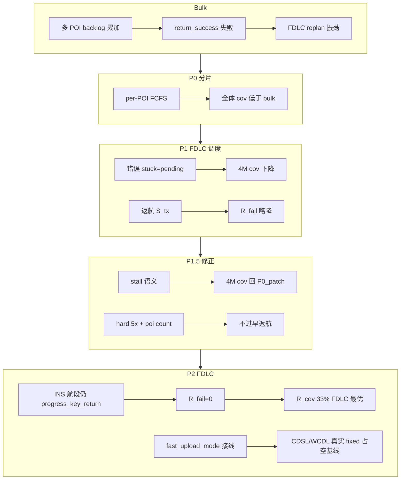

# Struct 轴回传重构：P0–P2 完成项与实验总结

> **场景**：C2 / `g2_cluster_m2`（120 POI）  
> **Sweep**：`configs/sweeps/paper1_axis_grid_struct_diag_m2.yaml`  
> **通信**：`configs/comm_profiles/c2.yaml`（`data_chunk_bits` = 1M / 4M / 8M）  
> **条件**：seed=0，5 episodes，Ts=40  
> **关联设计**：`Struct轴不同数据量下回传策略优化建议.md`  
> **历史 bulk 分析**：`docs/struct_axis_1m_4m_8mbit_analysis.md`  
> **生成日期**：2026-06-01（P2 段更新）

---

## 1. 背景：bulk 回传为何在 struct 轴失效

### 1.1 原模型（bulk）

- 覆盖 POI 后，待回传比特累加为 **单一 `backlog_bits` 总和**。
- `try_return_key()` 对 **整包 backlog** 做 `return_success(total_bits)` 判定：要么一步传完，要么本步无进展。
- 当 `data_chunk_bits` 增大（4M / 8M）时，单步 `b_eff × dt` 远小于 backlog → 长期「覆盖多、有效少」。

### 1.2 bulk 下的典型症状（`runs/debug/struct_goal_trace/{1Mbit,4Mbit,8Mbit}/`）

| 数据量 | 主要现象 |
|--------|----------|
| **1 Mbit** | 三架构 `R_fail\|cov=0`；FDLC 覆盖最高（~57%），测的主要是探索而非回传协作 |
| **4 Mbit** | CDSL/WCDL 与 1M 逐 ep 相同；**仅 FDLC** 失稳（`R_fail≈19%`，`pending_max` 8–40M，goal 振荡） |
| **8 Mbit** | 全体 `R_cov` 下降；FDLC 近乎崩溃（~2.5% cov，66% `R_fail\|cov`，60% 能量耗尽） |

**根因归纳**：批量 backlog + 回传时间阈值与 chunk 未标定 + FDLC 全量 f2s 与 `on_post_cover_upload_stuck` 触发的慢环 replan 正反馈。

---

## 2. P0：Per-POI 分片回传（已完成）

### 2.1 目标

用 **FCFS、按 POI 分片** 的 `ReturnQueue` 替代 bulk `try_return_key()`，使每步最多传输 `b_eff × dt` 比特，传完一个 POI 确认一个。

### 2.2 代码与配置变更

| 模块 | 路径 | 说明 |
|------|------|------|
| 回传队列 | `src/uavlab/paper1/sim/return_queue.py` | **新增** `ReturnBuffer` / `ReturnQueue`，`progress_step()` |
| 环境 | `src/uavlab/paper1/sim/env.py` | `return_queue`；`progress_key_return()`；`poi_pending_bits` 兼容属性 |
| Runner | `src/uavlab/paper1/runner/run.py`, `run_vis.py` | 每步调用 `progress_key_return(dt_s=dt)` |
| 配置 | `configs/base.yaml` | `comm.data_link.max_return_time_s: 15.0`（stall 超时） |
| 测试 | `tests/test_return_queue.py` | 单元 + env 集成 |
| 文档 | `README.md`, `docs/paper1_metrics_operationalization.md` | 分片模型说明 |

**Git**：已合并 `main`，commit `4f27839` — `feat(return): per-POI sharded key return with stall-based expiry (P0 baseline)`。

### 2.3 过期语义（P0 patch，修复首版 P0 缺陷）

| 版本 | 语义 | 后果 |
|------|------|------|
| **首版 P0** | 从 `covered_time` 起算超时 | 未传即过期 → 三架构坍缩（~5–6% cov，`T_nf≈0`，CDSL/WCDL 100% 能量耗尽） |
| **P0 patch（当前）** | 首次传输前 **不过期**；首次 TX 后仅 **stall**（`max_return_time_s` 内无进展）过期 | 行为可接受，作为后续 P1 基线 |

实现要点见 `return_queue.py` 文档字符串与 `test_no_expire_before_first_tx_*`、`test_stall_after_first_tx_*`。

### 2.4 P0 patch 实验结果（`1Mbit_P0_patch` / `4Mbit_P0_patch`）

相对 **bulk**（同目录 `1Mbit` / `4Mbit`）：

| 数据量 | 架构 | Bulk R_cov | P0_patch R_cov | Bulk R_fail\|cov | P0_patch R_fail\|cov |
|--------|------|------------|----------------|------------------|----------------------|
| 1M | CDSL | 38.0% | **31.8%** | 0 | 0 |
| 1M | WCDL | 46.5% | **40.3%** | 0 | 0 |
| 1M | FDLC | **56.7%** | **22.5%** | 0 | **8.1%** |
| 4M | CDSL | 38.0% | **18.3%** | 0 | 0 |
| 4M | WCDL | 46.5% | **27.0%** | 0 | 0 |
| 4M | FDLC | 26.2% | **25.3%** | **19.2%** | **8.2%** |

**P0 结论（已验证）**

- 分片方向 **正确**：FDLC 4M 不再出现 bulk 级 80% time_limit、40M pending 的极端振荡；`pending_max` 降至约 8–18M（4M）。
- P0 **alone 不够**：三架构相对 bulk 普遍 **损失 6–20 pp 覆盖率**；FDLC 仍有显著 `R_fail\|cov`。
- **1M + 4M** 适合作为回归档位；8M 仅作压力测试（单 POI 传完常 >10s）。

---

## 3. P1：FDLC backlog 感知调度（已完成）

### 3.1 目标（设计文档 §P1）

1. `paper1_loops.return_policy`：soft/hard backlog 阈值、`min_tx_gain_bits`。
2. backlog 高时 **暂停扩覆盖**，进入 **return phase**（`goal_id=None`）。
3. `upload_stuck` → **回传恢复**，不触发换 POI 的 warning replan。
4. 快环 `S_tx` / `S_rec` 绑定 `expected_tx_gain`；返航阶段不再误进 `S_ins`。
5. Balance 阶段提高慢环 `beta_ret`；FDLC 专用事件与 goal 边沿调整。

### 3.2 代码与配置变更

| 模块 | 路径 | 说明 |
|------|------|------|
| 契约 | `src/uavlab/paper1/contracts/return_policy.py` | **新增** `ReturnPolicyConfig`、`return_policy_from_cfg()` |
| 契约 | `src/uavlab/paper1/contracts/contract_config.py` | `Paper1ContractConfig.return_policy` |
| 快环 FSM | `src/uavlab/paper1/loops/fast/fsm.py` | `expected_tx_gain_bits()`；返航期 TX/REC；`min_tx_gain` 门控 |
| 快环 | `src/uavlab/paper1/loops/fast/fast_loop.py` | 向 FSM 传入 `dt`、`return_policy`、`dual_link` |
| 慢环 | `src/uavlab/paper1/loops/slow/slow_loop.py` | Explore/Balance/Return；`_sync_backlog_return_phase()`；`_apply_upload_stuck_recovery()` |
| 基座配置 | `configs/base.yaml` | `return_policy` 占位（默认 **关闭** gates） |
| FDLC | `configs/experiments/paper1/system/struct_full_dual_loop_distributed.yaml` | 开启 gates + stuck 恢复；`on_post_cover_upload_stuck: info`；仅 `on_goal_effective_complete` |
| Preset | `src/uavlab/experiments/presets.py` | `fdlc` preset 启用 `return_policy` |
| 测试 | `tests/test_paper1_return_policy.py` | P1 行为单测 |

**默认策略（P1 首版；P1.5 已调整，见 §4）**

- **FDLC**：`enable_backlog_gates=true`，`enable_upload_stuck_recovery=true`；soft=2×、hard=3× `data_chunk_bits`。
- **CDSL / WCDL**：gates 默认 **false**（P1 不改变其行为）。

### 3.3 P1 实验结果（`1Mbit_P1` / `4Mbit_P1` vs `*_P0_patch`）

#### 汇总表

| 数据量 | 架构 | P0_patch R_cov | P1 R_cov | Δ | P0_patch R_fail\|cov | P1 R_fail\|cov | Δ |
|--------|------|----------------|----------|---|----------------------|----------------|---|
| 1M | CDSL | 31.8% | 31.8% | 0 | 0 | 0 | 0 |
| 1M | WCDL | 40.3% | 40.3% | 0 | 0 | 0 | 0 |
| 1M | FDLC | 22.5% | **28.3%** | **+5.8pp** | 8.1% | **1.8%** | **−6.2pp** |
| 4M | CDSL | 18.3% | 18.3% | 0 | 0 | 0 | 0 |
| 4M | WCDL | 27.0% | 27.0% | 0 | 0 | 0 | 0 |
| 4M | FDLC | 25.3% | **16.3%** | **−9.0pp** | 8.2% | **4.7%** | −3.5pp |

#### FDLC 行为指标（P0_patch → P1）

| 指标 | 1M | 4M |
|------|----|----|
| T_ret (s) | 9.8 → 6.0 | 21.9 → 11.4 |
| goal_switch (mean) | 51 → 89 | 56 → 76 |
| replan (mean) | 319 → 251 | 324 → 250 |
| energy_rate | 20% → 20% | 0% → **40%** |

#### FDLC 分 episode 要点

**1M P1**：ep2 从 P0 的 10% cov（能量终止）恢复到 34% cov；多局 cov≈task（零 `R_fail`）。

**4M P1**：ep0–1 `R_fail=0`，但 ep2–4 降至 9–13% cov，ep3–4 **能量耗尽**（`T_nf=0`）；P0_patch ep2 仍有 33% cov 的健康局。

### 3.4 P1 是否符合预期

| 目标 | 1M | 4M | 判定 |
|------|----|----|------|
| 仅 FDLC 变化，CDSL/WCDL 不变 | ✓ | ✓ | **符合** |
| FDLC `R_fail\|cov` < 5% | 1.8% ✓ | 4.7%（边缘） | 1M **符合**；4M **部分** |
| FDLC 覆盖率回升 | +5.8pp，仍远低于 bulk 57% | **−9pp** | 1M **部分**；4M **不符合** |
| 恢复 FDLC > WCDL > CDSL | FDLC 仍最差 | FDLC 仍最差 | **不符合** |
| 抑制 stuck → goal 振荡 | replan↓，`R_fail`↓ | cov↓，能量问题↑ | **部分** |

**P1 验收结论**：方向正确，但 **4M 未通过**；首版 `upload_stuck` 将「有 pending」误判为 stuck（见 §4.1），需 P1.5 修正。

---

## 4. P1.5 / P1.5c：FDLC 调度修正（已完成）

### 4.1 P1.5a：`upload_stuck` = 传输 stall（非 pending）

**问题（P1 首版）**：`_is_post_cover_upload_stuck` 在 `backlog > 0` 时即判 stuck，`_apply_upload_stuck_recovery` 每步清 `goal_id` → 与分片模型冲突，4M cov 25%→16%。

**修复**：

- `ReturnQueue.is_poi_return_stalled()`：按 `covered_time_s` / `last_progress_time_s` 计算 stall；
- recovery 仅当 stall ≥ `upload_stuck_s`（默认按 chunk 分档：1M→60s，4M→30s）；
- `upload_stuck_min_pending_count: 2` + `upload_stuck_requires_soft_backlog: true`（首 POI 不强制返航）。

### 4.2 P1.5b：门控与 Balance

| 参数 | P1 | P1.5 |
|------|-----|------|
| `backlog_hard_mult`（4M） | 3×（12M≈3 POI） | **5×**（20M） |
| `backlog_*_poi_count` | 无 | soft=**2**，hard=**5** |
| `on_goal_spatial_complete` | false（P1 首版） | **true**（恢复） |
| Balance | 仅 `beta_ret×1.5` | `beta_ret×2.0`，`mu_dist×1.5`，`window_k//2` |

### 4.3 P1.5 / P1.5c 实验（`4Mbit_P1.5` / `4Mbit_P1.5c`）

| Tag | FDLC R_cov | FDLC R_task | FDLC R_fail\|cov | CDSL/WCDL |
|-----|------------|-------------|------------------|-----------|
| P0_patch | 25.3% | 23.2% | 8.2% | 18.3% / 27.0%，R_fail=0 |
| P1 | 16.3% | 15.8% | 4.7% | 不变 |
| **P1.5** | **25.5%** | 23.2% | 9.2% | 不变 |
| **P1.5c** | **26.3%** | 24.2% | 8.7% | 不变 |

- **4M**：cov 回到 P0_patch 水平，energy_rate 0%；`R_fail` 仍 ~8–9%（**仅 FDLC**）。
- **1M P1.5c**：FDLC 19.5% cov（低于 P1 的 28.3%），energy 40% — 1M 仍需与 4M 分档调参。

### 4.4 为何只有 FDLC 有 `R_fail|cov`（4M P1.5c 机理）

| 维度 | CDSL / WCDL | FDLC（P1.5c 前） |
|------|-------------|------------------|
| `use_comm_in_fast` | **false** | **true** |
| backlog>0 时 FSM | **强制 S_tx** | 新 goal 未覆盖 ⇒ **S_ins** |
| 赴下一 POI 时回传 | **S_tx → 每步 `progress_key_return`** | **S_ins → 调度器返回 false，暂停回传** |
| `pending_max` | ~4M（≈1 POI） | ~8–16M（2–4 POI） |
| episode 末 | covered = returned | covered > returned（1–5 POI/局） |

**要点**：

1. WCDL **同样**在 `spatial_complete` 时换 goal（并非等 effective 才更新慢环）。
2. WCDL 优势在于 **backlog>0 时快环保持 S_tx，边飞边传**；FDLC 在 S_ins 航段 **不传** → 多 POI 积压 → 覆盖后失败。
3. FDLC 探索更积极（可行域宽）→ 积压更严重。

---

## 5. P2：FDLC「S_ins 航段仍回传」（已完成）

### 5.1 改动

| 模块 | 行为 |
|------|------|
| `return_scheduling.py` | `fast_upload_mode=policy` 且 backlog>0：**即使 S_ins、spatial 未完成也 `progress_key_return`**（`return_during_ins_transit`） |
| `fsm.py` | backlog≥soft（balance/return 阶段）且 goal 未覆盖：FSM 保持 **S_tx/S_rec** 而非 S_ins |
| `run.py` / `run_vis.py` | 传入 `env.cfg.fast_upload_mode`、`fixed_send_ratio`、`step` |

### 5.2 P2 实验（`4Mbit_P2_ins_tx`）

| 架构 | R_cov | R_task | R_fail\|cov | 备注 |
|------|-------|--------|-------------|------|
| **FDLC** | **33.2%** | **33.2%** | **0%** | 5/5 ep 零失败；**FDLC > WCDL > CDSL** |
| WCDL | 8.7% | 7.8% | 10.7% | 见 §5.3 |
| CDSL | 9.7% | 9.0% | 8.5% | 见 §5.3 |

FDLC 相对 P1.5c：**R_fail 8.7%→0%**，**R_cov 26.3%→33.2%** — P2 目标达成。

### 5.3 重要：`fast_upload_mode` 接线修正（影响 CDSL/WCDL 基线）

P2 之前，`run.py` **未传入** `env.cfg.fast_upload_mode`，`should_attempt_key_return` 默认 **`policy`**。

| 架构 | preset | P1.5c 及以前（默认 policy） | P2 起（传入 fixed） |
|------|--------|------------------------------|---------------------|
| CDSL/WCDL | `fixed`, ratio=0.5 | spatial 完成后 **每步都传（≈100%）** | **50% 占空**（设计本意） |
| FDLC | `policy` | 本即 100% | 不变 |

**因此**：

- P0_patch～P1.5c 的 **CDSL/WCDL 4M 数值（18%/27%）偏高**，含 wiring bug 带来的 **双倍上传占空**；
- P2 sweep 中 CDSL/WCDL 降至 ~9%/8.7% **不是 INS 边传逻辑所致**，而是 **fixed 占空终于生效** + 4M 下单 POI 传完更慢 → 同时间内覆盖 POI 更少；
- **对比三架构时，P2 起应以同一 `fast_upload_mode` 接线后的结果为基线**；不宜与 P1.5c 的 CDSL/WCDL 直接比绝对值。

**建议**：在 struct 轴文档与论文中注明 **2026-06 P2 修正前后 CDSL/WCDL 不可混比**；或按 chunk 调高 CDSL/WCDL 的 `fixed_send_ratio`（P2 yaml 标定，非回退 FDLC 修复）。

---

## 6. 当前能力边界（P0→P2）

```text
                 bulk    P0_patch   P1.5c(FDLC)   P2_ins_tx(FDLC)   P2_ins_tx(WCDL/CDSL)*
4M  R_cov        26–47%  18–27%     26.3%        33.2%             ~9% / ~9%
4M  R_fail|cov   0–19%   0 / 8%     8.7%         0%                ~9–11%

* P2 起 fixed 占空接线修正后的新基线，不可与 P1.5c 的 WCDL 27% 直接对比
```

**已解决**

- bulk 单包回传不可行；P0 stall 过期；FDLC 返航期 S_ins 不传；
- P1 upload_stuck 误判（P1.5a）；4M hard 过早返航（P1.5b）；
- **FDLC 独有 R_fail|cov**（P2：S_ins 航段边飞边传）；
- **4M FDLC > WCDL > CDSL**（P2 FDLC 33% vs 修正基线下 WCDL/CDSL ~9%）。

**未解决 / 后续**

- 分片后全体相对 bulk 的 cov 缺口；CDSL/WCDL 在 **正确 fixed 占空** 下的 4M 标定；
- P2 三架构 **公平对比** 需统一接线 + 可选 per-chunk `fixed_send_ratio`；
- 8M 压力档；多 seed；summary 新字段（P3）。

---

## 7. 机制因果链（更新至 P2）



---

## 8. 遗留问题与后续工作

| 阶段 | 内容 | 状态 |
|------|------|------|
| **P1.5a/b/c** | stall 语义、hard 门控、recovery 门槛、Balance | **已完成** |
| **P2 ins_tx** | FDLC S_ins 边传 + soft 时 S_tx/S_rec + fast_upload_mode 接线 | **已完成** |
| **P2 标定** | CDSL/WCDL 4M `fixed_send_ratio` / stall 超时按 chunk | 待做 |
| **P2 yaml** | 三份 `struct_*.yaml` 差异化（§6.1–6.3） | **已完成** |
| **P3** | metrics/summary 新字段；多 seed；主表 4M | 待做 |

---

## 9. Run 目录与 sweep 命令

```bash
export PYTHONPATH=src
# 编辑 configs/comm_profiles/c2.yaml → data_chunk_bits
python3 scripts/sweep.py --plan configs/sweeps/paper1_axis_grid_struct_diag_m2.yaml --tag <TAG>
```

| 标签 | 含义 |
|------|------|
| `1Mbit` / `4Mbit` / `8Mbit` | bulk 基线 |
| `*_P0_patch` | P0 + stall 过期修复 |
| `*_P1` | + P1 FDLC backlog 调度（首版 stuck 有误） |
| `*_P1.5` / `*_P1.5c` | + stall 修正 + 门控调参 + recovery 门槛 |
| **`4Mbit_P2_ins_tx`** | **+ FDLC S_ins 边传；CDSL/WCDL fixed 占空接线修正** |

**推荐主表（4M）**：`4Mbit_P2_ins_tx`（FDLC）；对比 P1.5c 时 **仅比 FDLC 列**，CDSL/WCDL 需重跑 P2 基线或接受 fixed 占空修正说明。

---

## 10. 关键文件索引

| 用途 | 路径 |
|------|------|
| 设计总纲 | `Struct轴不同数据量下回传策略优化建议.md` |
| bulk 三档分析 | `docs/struct_axis_1m_4m_8mbit_analysis.md` |
| 本文档 | `docs/struct_return_p0_p1_summary.md` |
| 分片实现 | `src/uavlab/paper1/sim/return_queue.py` |
| 回传调度 | `src/uavlab/paper1/runner/return_scheduling.py` |
| P1/P1.5 契约 | `src/uavlab/paper1/contracts/return_policy.py` |
| 快环 FSM | `src/uavlab/paper1/loops/fast/fsm.py` |
| FDLC 系统配置 | `configs/experiments/paper1/system/struct_full_dual_loop_distributed.yaml` |
| 通信 profile | `configs/comm_profiles/c2.yaml` |

---

## 11. 一句话总结

**P0** 引入 per-POI 分片并修复 stall 过期。**P1** 为 FDLC 增加 backlog 门控，但首版 stuck 语义错误且在 4M 过早返航。**P1.5/P1.5c** 修正 stall、放宽 hard 门控，4M FDLC cov 回到 P0_patch，但 **仅 FDLC 仍有 ~9% R_fail\|cov**（S_ins 航段暂停回传）。**P2** 令 FDLC 在 backlog>0 时 **S_ins 航段仍分片回传**，4M 实现 **R_fail=0、R_cov≈33%、FDLC>WCDL>CDSL**；同时 **修正 `fast_upload_mode` 接线**，P2 起 CDSL/WCDL 才按 preset **50% fixed 占空**运行，**不可与 P1.5c 的 WCDL/CDSL 绝对值混比**。
